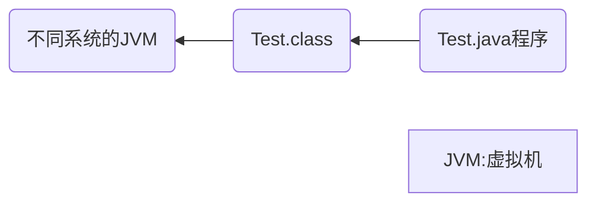

# Java基础学习

> 1. 初步认识Java，学会编写程序
> 2. 与C++进行比较学习，快速学完基础
> 3. 面向对象（三大特性：继承、封装、多态）
> 4. 异常处理
> 5. 常用类
> 6. 

## 第一章

---

### Java语言重要特点

> **面向对象的（Oop）**
>
> **健壮的**
>
> > 强类型机制、异常处理、垃圾的自动收集等,  提供了一个相对安全的内存管理和访问机制
>
> 简单性
>
> > Java就是C++语法的**简化版**,我们也可以称之为**C++--**
> >
> > 如:头文件,指针运算,结构,联合,操作符重载,虚基类等
>
> **跨平台性的**
>
> > 即一个编译好的.class文件可以在多个系统下运行
> >
> > ```mermaid
> > graph RL
> > 	A[Java语言是跨平台性的]
> > 	B(Test.java)-->C(Test.class)
> > 	C-->|运行|D(windows)
> > 	C-->|运行|E(Linux)
> > ```
>

> **解释型语言**
>
> > 如：Javascript、PHP、Java
>
> **编译型语言**
>
> > C/C++
> >
> > 区别：解释型语言编译后的代码不能直接被机器执行，需要解释器来执行，编译型语言可以直接执行
>
> **多线程**
>
> > 允许一个应用程序同时存在两个或两个以上的线程

---

### Java的开发工具

editplus、notepad++、Sublime Text、IDEA、eclipse

### Java运行机制及运行过程



说明：JVM（虚拟机）实现了Java程序在三个不同操作系统中的执行，提供了跨平台性

#### Java核心机制：Java虚拟机[JVM Java Virtual Machine]

> 1. **JVM**是一个虚拟的计算机，具有指令集并使用不同的存储区域。负责执行指令，管理数据、内存、寄存器，包含在**JDK**中
>
> 2. 不同平台需要安装不同的**JVM**
>
> 3. Java虚拟机机制屏蔽了底层运行平台的差别，实现了“**一次编译，到处执行**”
>
>    ```mermaid
>    graph LR
>    	A(Test.java)-->|javac编译|B(Test.class)
>    	B-->|java运行|C(JVM for Linux)
>    	B-->|java运行|D(JVM for Windows)
>    	B-->|java运行|E(JVM for MacOS)
>    ```

---

**JVM功能**

实现Java程序的跨平台性

> 有Java虚拟机只需要编写m+n种编译器和解释器,面向**JVM**编程

自动的内存管理(内存分配,内存回收)

> - **Java**程序在运行过程中,涉及到运算的**数据分配,存储**都由**JVM**完成
>
> - **Java**消除了程序员回收无用内存空间的职责.提供了一种**系统级线程跟踪存储空间分配情况**的能力,在内存空间达到相应阈值时,自动检查并释放可以被释放的存储器空间
>
> - **GC**的自动回收,提高了内存空间的利用效率,也提高了编程人员使用的效率,很大程度上**减少了**因为没有释放空间而导致的**内存泄漏**
>
>   > **Java**程序仍然存在内存溢出和内存泄漏的问题

---

### 认识JDK、JRE

#### JDK基本介绍

1. JDK的全称：Java Development Kit / Java开发工具包

   JDK = JRE + Java开发工具（Java、javac、javadoc、javap等）

2. JDK提供给Java开发人员使用，JDK包含JRE

#### JRE基本介绍

1. JRE（Java Development Kit / Java开发工具包）**JRE = JVM + Java的核心类库**
2. 如果只想运行一个开发好的Java程序，计算机中只需要安装JRE即可

#### Java版本

JavaSE / J2SE（标准版）

JavaEE / J2EE（企业版）

JavaME / J2ME（小型版）

#### 总结

1. JDK = JRE + 开发工具集（例如Javac、Java编译工具等）
2. JRE = JVM + Java SE标准类库
3. JDK = JVM + Java SE标准类库 + 开发工具集
4. 如果只想运行开发好的.class文件，只需要JRE
5. SDK：软件开发工具包

---

### Java中高级程序员学习路线图


---

### 配置PATH环境变量

> > JDK17自动配置环境变量，JDK8需手动配置

##### 配置方案一

> 1. 复制 **JDK **的bin目录路径 A:\B\C\bin
> 2. 配置环境变量，新建用户或系统的环境变量
> 3. 将bin目录地址添加并上移
> 4. 重启cmd并测试

##### 配置方案二

> 1. 新建系统变量名 JAVA ——HOME
> 2. 修改变量值为 A:B\C //C为 **JDK** 的文件路径
> 3.  编辑环境变量，添加**%JAVA_HOME%\bin**并上移
> 4. 重启cmd并测试
>
> > 为了方便后续Java高级内容学习，建议使用配置方案二

---

### Java语法教学


定义**main**方法

```java
public static void main(String[] args) {
    
}
// mian方法的格式是固定的
```


输出 `Hello World`

```java
public static void main(String[] args) {
    system.out.println("Hello World");
}
```

---

**定义主类**

> 主类定义了Java程序的执行起点，程序运行时会从主类的**main方法**开始执行

```java
public class Main {
    public static void main(String[] args) { //可以写成main(String args[])
        // 主类的入口点，程序从这里开始执行
        System.out.println("Hello, World!"); // 输出 Hello, World!
    }
}
//args:arguments
```

> > Java严格区分大小写


从控制台输出数据并换行

```java
System.out.println("###");
```

---

**注释**

单行注释

```java
// 单行注释
```

多行注释

```java
/*
多行注释
多行注释
*/
```

文档注释 `Java特有`

```java
/**
	@author 指定Java程序的作者
	@version 指定源文件的版本
	......
*/
```

> > **文档注释内容**可以被JDK提供的工具**Javadoc**所解析,生产一套以网页形式体现的该程序的说明文档
>
> ```java
> /**
> 
> 说实话我不是很想写文档注释,这太麻烦了,事实上我认为这应该是ChatGPT该干的事
> 
> @author uncle_yumo
> @version 1.123
> uncleyumo@123.com
> 
> */
> ```
>
> 生产文档注释的网页文件
>
> > ```cmd
> > javadoc -d mydir -author -version Main.java
> > ```
> >
> > 

**Java API 文档**

##### 案例一: 个人信息输出

```java
class PersonalInfo {
    public static void main(String args[]) {
        System.out.println("姓名: 康师傅");
        System.out.println("性别: 沃尔玛便利袋");
        System.out.println("家庭住址: 北京市朝阳区朝阳派出所");
    }
}
```

---

##### 第一章随堂复习与企业真题

1. 一个源文件中可以声明多个类,但是最多只能有一个类使用public进行声明.且要求声明为public的类的类名与源文件名相同.

2. Java的优势

   > - 跨平台性
   > - 安全性高
   > - 简单性
   > - 高性能
   > - 健壮性
   > - 面向对象性
   >
   > > 社区繁荣,开源框架众多,开发者数量庞大

3. 如何看待Java是一门半编译半解释型语言

   > ```mermaid
   > graph LR
   > 	A(Java源码 / ###.java)-->|生成|B[词法分析]
   > 	B-->C[语法分析]
   > 	C-->D[语义分析]
   > 	D-->E[字节码生成器]
   > 	E-->|生成|F(字节码 / ###.class)
   > ```
   >
   > ```mermaid
   > graph LR
   > A(字节码)-->B[类加载器]
   > B-->C[字节码验证器]
   > C-->D(解释器 / 解释执行)
   > C-->F(JIT编译器 / 编译执行)
   > D-->G[机器码]
   > F-->G
   > G-->H(操作系统)
   > ```

   ## 第二章

   ### 数据类型

   **基本数据类型(8种)**

   > - 整型: byte(1B) \ short(2 B) \ int(4 B) \ long(8 B)
   > - 浮点型: float \ double
   > - 字符型: char
   > - 布尔型: boolean
   
   **引用数据类型**

   > - 类(class)
   > - 数组(array)
   > - 接口(interface)
   > - 枚举(enum)
   > - 注解(annotation)
   > - 记录(record)
   
   ---

   **基本数据类型变量间的运算规则**

   > 自动类型提升
   >
   > ```java
   > // 规则:当容量小的变量与容量大的变量做运算时,结果自动转换为容量大的数据类型
   > // 容量指表示数据范围的大小而非所占内容空间的大小
   > byte ---> short ---> int ---> long ---> float ---> double
   > // byte与short类型变量做运算,结果为int类型
   > ```
   >
   > 强制类型提升
   >
   > ```java
   > 
   > ```
   
   ### 位运算符 (难点非重点)

   **基本语法** 位运算符针对数值类型常量进行计算.运算结果也是数值

   > **左移 <<**
   >
   > ```java
   > // 一定范围内,每向左移动一位,原数值*2,对于正负数都适用
   > int num = 2;
   > System.out.println(num << 2);
   > // 结果:8
   > 
   > int aunm = -2;
   > System.out.println(anum << 2);
   > // 结果:-8
   > ```
   >
   > > **面试题**: 用高效的方式计算 2 * 8
   > >
   > > > 2 << 3 或者 8 << 1
   >
   > **右移 >>**
   >
   > ```java
   > // 一定范围内,每向右移动一位,原数值/2,正负数通用
   > ```
   >
   > > **问题**: 如何交换两个int型变量的值, String呢?
   > >
   > > ```java
   > > // 交换两个int型变量的值
   > > class Exchange {
   > >  public static void main(String args[]) {
   > >      int m = 10;
   > >      int n = 20;
   > >      // 交换
   > >      int temp = 0;
   > >      temp = 10;
   > >      m = n;
   > >      n = temp;
   > >      System.out.println("m = " + m + ", n = " + n);
   > >  }
   > > }
   > > 
   > > // 方式二
   > > class Exchange2 {
   > >  public static void main(String args[]) {
   > >      int m = 10;
   > >      int n = 20;
   > >      // 交换
   > >      m = m + n;// m = 10 + 20 = 30
   > >      n = m - n;// n = 30 - 20 = 10
   > >      m = m - n;// m = 30 - 10 = 20
   > >      System.out.println("m = " + m + ", n = " + n);
   > >  }
   > > }
   > > 
   > > // 方法三
   > > class Exchange3 {
   > >  public static void main(String args[]) {
   > >      int m = 10;
   > >      int n = 20;
   > >      // 交换
   > >      m = m ^ n;
   > >      n = m ^ n;
   > >      m = m ^ n;
   > >      // 看不懂，真的，脑瘫才这么写
   > >      System.out.println("m = " + m + ", n = " + n);
   > >  }
   > > }
   > > ```
   > >
   > > ```java
   > > // 交换两个String类型变量的值
   > > class Exchange {
   > >  public static void main(String args[]) {
   > >      String m = "Hello";
   > >      String n = "World";
   > >      // 交换
   > >      String temp = "";
   > >      temp = m;
   > >      m = n;
   > >      n = temp;
   > >      System.out.println("m = " + m + ", n = " + n);
   > >  }
   > > }
   > > ```
   > >
   
   ---
   
   ##### 第二章随堂复习与企业真题
   
   1. 关键字、保留字
   
      - 关键字：被Java赋予特殊含义的字符串，官方规范中有50个，不包含true，false，null（可看作关键字）
      - 保留字：goto，const
   
   2. 标识符命名规则
   
      - 包名
   
        > 多单词组成时所有字母都小写：xxxyyyzzz
        >
        > 例如：java.lang , com.fuckyou.bean
   
      - 变量名，方法名
   
        > 多单词组成时，第一个单词首字母小写，第二个单词开始每个单词首字母大写：xxxYyyZzz
        >
        > 例如：age , name , bookName , main , binarySearch , getName
   
      - 类名，接口名
   
        > 多单词组成时，所有单词的首字母大写：XxxYxxZzz
        >
        > 例如：HelloWorld，String，System
   
      - 常量名
   
        > 所有字母都大写。多单词时每个字母都用下划线连接：XXX_YYY_ZZZ
        >
        > 例如：MAX_VALUE , PI , DEFAULT_CAPACITY
   
   3. 测试字符型和布尔型
   
      - 声明long类型变量时，需要提供后缀。后缀为`l`或`L`
   
        ```java
        long num_long = 123123123l // 123123123L
        ```
   
      - 声明float类型变量时，需要提供后缀`f`或`F`
   
        ```java
        float f1 = 12.3f // 12.3F
        ```
   
      - 实际开发中的浮点型通常用double
   
      - 通过测试发现浮点型变量的精度不高时，则需要使用BigDecimal类替换浮点型变量
   
      - boolean类型在实际的内存分配中，占用4个字节
   
   4. 取模 / 取余
   
      ```java
      int i = 12;
      int j = 5;
      System.out.println("i % j"); // 结果：2
      ```
   
   **企业真题**
   
   1. &与&&的区别
   
      > &为位运算符，&&为逻辑运算符
      >
      > &左右两边都会计算，而&&当左侧为false则直接输出false，省去右边计算
   
   2. Java中有8中基本数据类型，不包括String，String属于引用类型
   
   3. Java开发中计算金额需要使用BigDecimal类，可以实现任意精度的数据运算
   
   4. int i = 0; i = i++; 执行后i的值仍为0
   
   5. 如何将两个变量的值互换
   
      > ```java
      > String s1 = "abc";
      > String s2 = "123";
      > 
      > String temp = s1;
      > s1 = s2;
      > s2 = temp;
      > ```
   
   6. boolean占几个字节
   
      > 编译时不谈几个字节
      >
      > 但是在JVM给boolean类型分配内存空间时，boolean类型的变量占据一个槽位（slot，等于4个字节）
      >
      > 细节：true：1 ；false：0
      >
      > 拓展：在内存中，byte/short/char/boolean/int/float/占用1个slot；double/long占用2个slot
      >
   
   7. 为什么Java中**0.1+0.2**结果不是**0.3**
   
      包括JavaScript、Ruby、Python、Swift和Go等语言都使用**IEEE 754标准**（电气电子工程师学会）
      
      > 整数变为二进制，能够做到”每个十进制整数都有对应的二进制数“
      >
      > 对于小数，无法做到”每个小数都有对应的二进制数字“
      >
      > 因此，遇见小数的情况，比如开发银行、交易等系统，可以采用**四舍五入**或者**同乘同除**等方式进行验证

## 第三章

### 流程控制

**if-else**

```java
//格式1
if(a==b) {
    System.out.println("Format 1");
}

//格式2
if(a==b) {
    System.out.println("aaa");
}else {
    System.out.println("bbb");
}

//格式3
if(a==b) {
    System.out.println("aaa");
}else if {
    System.out.println("bbb");
}else if {
    System.out.println("ccc");
}else {
    System.out.println("ddd");
}
```

**使用Scanner类从键盘获取数据**

```java
//导包
import java.util.Scanner;
//创建Scanner类型的对象
Scanner scan = new Scanner(System.in);
//调用Scanner类的相关方法(next() / nextXxx()),来获取指定类型的变量

//取第一个位置的字符
scan.next().charAt(0) 


//释放资源 scan在控制台被使用，如果不主动回收将会被GC忽略回收，造成内存泄漏
scan.close();

//注意：需要根据相应的方法，来指定类型的值。如果输入的数据类型与要求的类型不匹配时，会报异常导致程序终止
```

> Scanner类中提供了获取byte\short\int\float\double\boolean\String类型变量的方法，但没有提供获取char类型变量的方法，需要使用next().charAt(num)来获取

**如何获取一个随机数**

```java
/*
使用Java提供的API：Math类的random() [0.0,1.0]
Math在Long包中，不需要导入
*/
double d1 = Math.random();
System.out.println(d1);

//获取一个[0,100]范围的随机数
Math.random() * 100;

//获取一个[1,100]范围的随机数
(int)(Math.random() * 100)+1
    
//获取一个[a,b]范围的随机整数
    (int)(Math.random() * (b - a + 1)) + a
```

**switch-case**

```java
 //Grammer format
switch(Expression) {
    case constant_1:
        Execute_statement_1;
        break;
    case constant_2:
        Execute_statement_2;
        break;
    default:
        Execute_statement_3;
        break;
}
```

> 使用switch-case实现：对学生成绩大于60分的，输出合格，低于60分的输出不合格。
>
> ```java
> import java.util.Scanner;
> 
> public class Switch_case {
>     public static void main(String[] args) {
> 
>         System.out.println("请输入学生成绩：");
>         Scanner scan = new Scanner(System.in);
>         double score = scan.nextInt();
> 
>         boolean situation_1 = score > 60;
>         int evaluate = 0;
>         if(situation_1) {
>             evaluate += 1;
>         }
> 
>         switch (evaluate) {
>             case 1:
>                 System.out.println("成绩合格");
>                 break;
> 
>             default:
>             System.out.println("成绩不合格");
>                 break;
>         }
> 
>     }
> }
> ```

---

> 编写程序，从键盘上输入2023年的“month”和“day”，要求通过程序输入判断日期为2023年的第几天
>
> ```java
> import java.util.*;
> public class Evaluate_data {
>     public static void main(String[] args) {
> 
>         Scanner scan = new Scanner(System.in);
> 
>         System.out.println("请输入月份：");
>         int month = scan.nextInt();
>         System.out.println("请输入日期");
>         int day = scan.nextInt();
> 
>         int[] monthNum = {31,29,31,30,31,30,31,31,30,31,30};
> 
>         int days = 0;
>         days = days + day;
>         for(int i = 0;i < month-1;i++) {
>             
>             days = monthNum[i] + days;
> 
>         }
> 
>         System.out.println("这是2024年的第" + days + "天");
> 
>     }
> }
> ```

**循环结构**

循环结构的四个要素：

	1. 初始化条件
	1. 循环条件
	1. 循环体
	1. 迭代部分

- for循环

  > ```java
  > for(A;B;C) {
  > 	statement;
  > }
  > ```
  >
  > 输出1000以内所有的水仙花数
  >
  > ```java
  > public class CirculatingMark {
  > public static void main(String[] args) {
  > 
  >   int temp = 0;
  >   System.out.println("1000以内的水仙花数有：");
  >   for(int i = 100;i < 1000;i++) {
  > 
  >       int unitPlace = (int) i % 10;
  >       int decadePlace = (int) i / 10 % 10;
  >       int hundredPlace = (int) i / 100;
  > 
  >       temp = unitPlace*unitPlace*unitPlace + decadePlace*decadePlace*decadePlace + hundredPlace*hundredPlace*hundredPlace;
  >       if(i == temp) {
  >           System.out.print(i + "\t");
  >       }
  > }
  >   
  > }
  > }
  > ```
  > 
  >输入两个正整数m和n，求其最大公约数和最小公倍数
  > 
  >```java
  > //最大公约数：
  > int m = 40;
  > int n = 60;
  > int result = 0;
  > int min = (m < n)? m:n;
  > for(int i = min;i >= 1;i--) {
  > if(m % i == 0 && n % i == 0) {
  > result = i;
  >   break;
  >   }
  > }
  > ```
  > 
  >计算质数
  > 
  >```java
  > public class CirculatingMark {
  > public static void main(String[] args) {
  >  
  > 
  >   int count = 0;
  >      long time_start = System.currentTimeMillis();
  >      for(int i = 2;i <= 100000;i++) {
  >    
  >       count = 0;
  >    
  >       for(int m = 2;m < i;m++) {
  >    
  >           if(i % m == 0) {
  >                  count++;
  >              }
  >          }
  >    
  >       if(count == 0) {
  >              System.out.println(i);
  >          }
  >    
  > 
  > 
  >   }
  >      long time_end = System.currentTimeMillis();
  >      System.out.println("The cost of time is : " + (time_end - time_start));
  >    
  > }
  >  
  > }
  > ```
  > 
  >获取系统当前时间
  > 
  >```java
  > long time_now = System.currentTimeMillis(); //毫秒级
  > ```
  > 
  >项目实战《谷粒记账软件》
  > 
  >```java
  > 
  > ```
  > 

**企业真题**

1. Java支持哪些类型的循环
   - for; while; do-while
   - 增强for循环/foreach（集合中讲解）

## 第四章

1. Java项目结构

   层级关系：project - module - package - class

   具体内容：

   - 一个project中可以创建多个module
   - 一个module中可以创建多个package
   - 一个package中可以创建多个class

   > 这些结构的划分是为了方便管理不同功能的代码

2. Project和Module的概念

## 第五章

### 数组


**数组的声明和初始化**

- Static initialization: The assignment of array variables is performed simultaneously with the assignment of array elements.

- Dynamic initialization: The assignment of array variables is performed separately from the assignment of array elements.

> ```java
> //declare an array
> double[] prices;
> //assignment the array that had been declared
> prices = new double[]{0,1,2,3,4,5,6,7,8,9}
> 
> //init a new array
> String[] foods = new String[4];
> 
> ```

**数组内存结构**

> 1. Java中内存结构使如何划分的（重点为JVM运行时的内存环境）
>
>    将内存区域划分为5个部分：程序计数器、虚拟机栈、本地方法栈、堆与方法区
>
> 2. 与目前数组相关的内存结构：如 int[ ] arr = new int[ ]{1, 2, 3};
>
>    虚拟机栈：用于存放方法中声明的变量，如 arr
>
>    堆：用于存放数组中的实体（即数组中的所有元素），如 1，2，3
>
> 3. 出现**new**代表堆区新开辟空间，否则沿用被复制对象的堆区数据，类似C中的指针
>
> 4. 在main()中声明变量：
>
>    > 虚拟机栈：main()作为一个栈帧，压入栈空间中。在main()栈帧中，存储着arr变量，arr记录着实体数组的首地址

**数组练习题**

> ```java
> //Question : Input the INFO of student and make judgments about their grades and scores;
> import java.util.*;
> 
> class judgmentGrade {
>  String returnGrade(int score) {
>      if(score < 60) {
>          return "D";
>      } else if (score >= 60 && score < 80) {
>          return "C";
>      } else if (score >= 80 && score <90) {
>          return "B";
>      } else if (score >= 90) {
>          return "A";
>      }
>      return "错误";
>  }
> 
> }
> 
> public class ArrayLearning {
>  public static void main(String[] args) {
> 
>      //dynamic init array
>      Scanner scan = new Scanner(System.in);
>      System.out.println("Please input the number of all students.");
> 
>      int count = scan.nextInt();
>      int[] scores = new int[count];
> 
>      int max_score = 0;
> 
>      //enter the student grades in sequence and save the grades in sequence in the array elements
>      System.out.println("Please input the score in sequence.");
>      for(int i = 0;i < scores.length;i++) {
>          scores[i] = scan.nextInt();
>          if(scores[i] >= max_score) {
>              max_score = scores[i];
>          }
>      }
> 
>      //go through the array elements,according to the difference between the student's score and the highest score,
>      //get a grade for each student and output the score and grade.
>      //90-100 A;80-89 B;60-79 C;0-59 D;
> 
>      judgmentGrade jGrade = new judgmentGrade();
> 
>      System.out.println("The highest score is : " + max_score);
>      for(int i = 0;i < scores.length;i++) {
>          System.out.println("Student " + (i+1) + " score is " + scores[i]
>                                 + " ;grade is : " + jGrade.returnGrade(scores[i]));
>         }
> 
> 
>     }
> }
> 
> //array in revrese order
> 
> import java.util.*;
> 
> class randomOperation {
>     int getRandom_Int(int a,int b) {
>         //获取一个[a,b]范围的随机整数
>         return (int)(Math.random() * (b - a + 1)) + a;
>     }
> 
>     double getRandom_Double(double a,double b) {
>         //获取一个[a,b]范围的随机整数
>         return (Math.random() * (b - a + 1)) + a;
>     }
> }
> 
> class arrayOperation {
>     void printArray(int array[]) {
>         for(int i = 0;i < array.length;i++) {
>             System.out.print(array[i] + " , ");
>         }
>         System.out.println("");
>     }
> }
> 
> public class ArrayLearning {
>     public static void main(String[] args) {
> 
>         System.out.println("--------Program Starts--------");
> 
>         randomOperation randomNum = new randomOperation();
>         arrayOperation arrOperation = new arrayOperation();
> 
>         int[] array = new int[11];
>         for(int i = 0;i < array.length;i++) {
>             array[i] = randomNum.getRandom_Int(10,99);
>         }
> 
>         arrOperation.printArray(array);
> 
>         for(int i = 0;i < array.length/2;i++) {
>             int backNum = array.length-1-i;
>             int temp = array[backNum];
>             array[backNum] = array[i];
>             array[i] = temp;
>         }
> 
>         arrOperation.printArray(array);
> 
>         System.out.println("--------Program Closed--------");
> 
>     }
> }
> ```

**二维数组的声明和初始化**

- the declaration and initialization of the two-dimensional arrays

> ```java
> int[][] = new int[3][2] //3 row with 2 column
> //使用未初始化的数组空间会报内存错误
> ```

**数组中常见的算法操作**

- Common Algorithm Operations In Arrays

> 1. 数组扩容
>
>    ```java
>    int[] arr = new int[] = {1,2,3,4,5};
>
>    //double capacity expansion
>    int[] newArr = new int[arr.length * 2]; //arr.length * 2 === arr.length << 1 --bit operation
>
>    //copy the elements from the orignial array into the new array.
>    for(int i = 0;i < arr.length;i++) {
>        newArr[i] = arr[i];
>    }
>    arr = newArr //make the address of the old array point to the new one
>    ```
>
>    > 注意，此处arr与newArr皆为堆区的栈帧，真正的数组数据存放于堆区，因此此处可以翻译为将栈区中名为arr的栈帧指向堆区新数组的首地址
>
> 2. 删除数组中指定的元素
>
>    > ```java
>    > import java.util.*;
>    > 
>    > class randomOperation {
>    >     int getRandom_Int(int a,int b) {
>    >         //获取一个[a,b]范围的随机整数
>    >         return (int)(Math.random() * (b - a + 1)) + a;
>    >     }
>    > 
>    >     double getRandom_Double(double a,double b) {
>    >         //获取一个[a,b]范围的随机浮点数
>    >         return (Math.random() * (b - a + 1)) + a;
>    >     }
>    > }
>    > 
>    > class arrayOperation {
>    >     void printArray(int array[]) {
>    >         for(int i = 0;i < array.length;i++) {
>    > 
>    >             System.out.print(array[i]);
>    >             if(i < array.length - 1) {
>    >                 System.out.print(" , ");
>    >             }
>    >         }
>    >         System.out.println();
>    >     }
>    > }
>    > 
>    > public class ArrayLearning {
>    >     public static void main(String[] args) {
>    > 
>    >         System.out.println("--------Program Starts--------");
>    > 
>    >         //Build an array which length is 10 using randomOperation
>    >         randomOperation randomNum = new randomOperation();
>    >         arrayOperation arrOperation = new arrayOperation();
>    >         int[] arr = new int[10];
>    > 
>    >         for(int i = 0;i < arr.length;i++) {
>    >             arr[i] = randomNum.getRandom_Int(10,99);
>    >         }
>    >         arrOperation.printArray(arr);
>    > 
>    >         //delete an element of the array
>    >         Scanner scan = new Scanner(System.in);
>    >         System.out.print("Please input the Index of the array's element to be deleted : ");
>    >         int deleteIndex = scan.nextInt();
>    >         int[] newArr = new int[arr.length -1];
>    > 
>    >         for(int i = deleteIndex;i < arr.length;i++) {
>    >             arr[i - 1] = arr[i];
>    >         }
>    > 
>    >         for(int i = 0;i < newArr.length;i++) {
>    >             newArr[i] = arr[i];
>    >         }
>    > 
>    >         arr = newArr;
>    >         
>    >         arrOperation.printArray(arr);
>    > 
>    >         System.out.println("--------Program Closed--------");
>    > 
>    >     }
>    > }
>    > 
>    > ```
>
> 3. 数组的线性查找（太low所以不演示代码了）与二分法查找
>
>    > ```java
>    > //二分法查找的前提：数组内元素必须是有序排列
>    > import java.util.*;
>    > 
>    > class randomOperation {
>    >     int getRandom_Int(int a,int b) {
>    >         //获取一个[a,b]范围的随机整数
>    >         return (int)(Math.random() * (b - a + 1)) + a;
>    >     }
>    > 
>    >     double getRandom_Double(double a,double b) {
>    >         //获取一个[a,b]范围的随机整数
>    >         return (Math.random() * (b - a + 1)) + a;
>    >     }
>    > }
>    > 
>    > class arrayOperation {
>    >     void printArray(int array[]) {
>    >         for(int i = 0;i < array.length;i++) {
>    > 
>    >             System.out.print(array[i]);
>    >             if(i < array.length - 1) {
>    >                 System.out.print(" , ");
>    >             }
>    >         }
>    >         System.out.println();
>    >     }
>    > }
>    > 
>    > public class ArrayLearning {
>    >     public static void main(String[] args) {
>    > 
>    >         System.out.println("--------Program Starts--------");
>    > 
>    >         //Build an array which length is 10 using randomOperation
>    >         randomOperation randomNum = new randomOperation();
>    >         arrayOperation arrOperation = new arrayOperation();
>    >         int[] arr = new int[10];
>    > 
>    >         for(int i = 0;i < arr.length;i++) {
>    >             arr[i] = randomNum.getRandom_Int(-99,99);
>    >         }
>    >         arrOperation.printArray(arr);
>    > 
>    >         //bubble sort | order from smallest to largest
>    >         for(int i = 0;i < arr.length - 1;i++) {
>    >             for(int j = 0;j < arr.length - 1 - i;j++) {
>    >                 if(arr[j] > arr[j+1]) {
>    >                     int temp = arr[j+1];
>    >                     arr[j+1] = arr[j];
>    >                     arr[j] = temp;
>    >                 }
>    >             }
>    >         }
>    > 
>    >         arrOperation.printArray(arr);
>    > 
>    >         int target = randomNum.getRandom_Int(0,9);
>    >         System.out.println("Target element is : " + arr[target]);
>    > 
>    >         int head = 0;
>    >         int end = arr.length - 1;
>    >         boolean isFlag = false;
>    > 
>    >         while(head <= end) {
>    >             int middle = (head + end) / 2;
>    >             if(arr[middle] == arr[target]) {
>    >                 System.out.println("Find target element : " + arr[middle] + "\nIndex is : " + middle);
>    >                 isFlag = true;
>    >                 break;
>    >             } else if (arr[middle] < arr[target]) {
>    >                 head = middle + 1;
>    >             } else if (arr[middle] > arr[target]) {
>    >                 end = middle - 1;
>    >             }
>    >         }
>    > 
>    >         if(!isFlag) {
>    >             System.out.print("Target isn't in this array!");
>    >         }
>    > 
>    >         System.out.println("--------Program Closed--------");
>    > 
>    >     }
>    > }
>    > 
>    > ```
>
> 4. 快速排序（快排Quick Sort）Time Complexity : n * lon~2~ n
>
>    > 原理解析：
>    >
>    > - 先在数组中随机挑选一个基准值（如第一个元素）
>    >
>    >   将数组中的数组分成比它小和比他大的两部分
>    >
>    > - 再从每一部分重复第一步，选出一个基准值并按大小分成两个部分
>    >

**Arrays工具类的使用**

- ```import java.util.Arrays;```

> 1. 比较两个数组元素是否依次相等
>
>    ```java
>    boolean equals(int[] a,int[] b);
>    ```
>
> 2. 输出数组元素信息
>
>    ```java
>    String string = Arrays.String toString(int[] a);
>    ```
>
> 3. 将指定值填充至数组中
>
>    ```java
>    int value = 10;
>    Array.fill(arr,value);
>    ```
>
> 4. 使用快速排序算法实现排序
>
>    ```java
>    int[] arr = new int[]{11,55,88,33,99,66,88,77,44,22};
>    Arrays.sort(arr);
>    
>    System.out.println(Arrays.toString(arr));
>    ```
>
> 5. 二分查找
>
>    ```java
>    int value = 10;
>    int index = Arrays.binarySearch(arr,value);
>    //if index < 0 === not found
>    ```

**数组中使用的常见异常小结**

> 1. 数组角标越界的异常
>
>    ArrayIndexOutOfBoundsException
>
> 2. 空指针的异常
>
>    NullPointerException // 数组的栈帧被抹除了，堆区失去联系无法调用 or 堆区的数组还未指定，如动态初始化，无法调用 or 在堆区值为Null时调用数组方法

**出现异常会怎样，如何处理**

> 1. 一旦程序执行中出现异常，程序就会终止执行
> 2. 针对异常提供的信息，修改对应的代码，避免异常在此出现
>

**企业真题**

> 1. 数组没有length()这个方法，但有length属性，String有length()
>
> 2. 有数组int[] arr,用Java代码将数组中的元素颠倒
>
>    ```java
>    int[] arr = new int[]{9,8,7,6,5,4,3,2,1,0};
>    for(int i = 0;i < ((arr.length) / 2);i++) {
>        int temp = 0;
>        temp = arr[i];
>        arr[i] = arr[arr.length - 1 - i];
>        arr[arr.length - 1 - i] = temp;
>    }
>    ```
>
> 3. 数组有哪些排序方式，手写一下？
>
>    冒泡排序，快速排序，希尔排序等
>
> 4. 常见排序算法，说下快排过程，时间复杂度？

# 第六章

## 类与对象 class and object

**对象在内存中的分配涉及到的内存结构（理论）**

> 1. 栈区（stack）：方法内定义的变量，存储在栈中
> 2. 堆区（heap）：new出来的结构（数组的实例、对象的实例），包括对象中的属性
> 3. 方法区（method area）：存放类的模板，比如：Person类的模板（次重要）

**类对象中的内存解析**

> 1. 创建类的一个对象，属性赋值
>    - 每一个方法的调用，对应栈区的一个栈帧
>    - 方法内的变量称为局部变量，也存放在对应方法存在的栈帧中
>    - new的实例皆在堆区，如```Person p1 = new Person();```，p1存放在栈帧中，其保存着堆区所new对象实例的地址，对象实例中存放着对象的属性
> 2. 创建类的多个对象，属性赋值
>    - 用已存在的实例还初始化实例，如```Person p3 = p1;```，p3存放在主方法栈帧中，p3指向p1在堆区的首地址，由于没有new操作，所以不会开辟新的堆区空间
>    - 创建类的多个对象时，每个对象在堆空间中有一个对象实例。每个对象实例中保存着一份类的属性。不同实例的属性值相互独立
> 3. 对象调用方法的过程

**类对象中的方法**

> 1. 方法调用的内存解析
>    - 形参：方法在声明时，一对 () 内声明的一个或多个形式参数，简称形参
>    - 实参：方法在被调用时，实际传递给形参的变量或常量，为实际参数，简称实参
>    - 内存解析：每一个方法对应一个栈帧，如每次主方法main()调用时都会开辟一块栈帧的空间，凡是new出来的实例都在堆区，实例名仅保存在栈帧中，其指向堆区的实例首地址，实例的成员变量都在堆区，每次调用实例方法时，都会开辟一个新的栈帧（每次掉方法都会开辟新的栈帧），方法的局部变量都在方法开辟的栈帧里，即局部变量在栈区，返回值也在栈中，被main()接收，属于主方法
> 2. 

**方法的值传递机制**

> 1. 引用数据类型的值传递机制
>
>    > 基本数据类型没有所谓的地址，只有数据值，如在主方法中的```int n = 10; int m = 20;```
>
>    - 数组类型
>
>      ```java
>      int[] arr1 = new int[]{1,2,3,4};
>      int[] arr2 = arr1;
>      arr2[0] = 10;
>      System.out.println(Arrays.toString(arr1)); // [10,2,3,4]
>      ```
>
>    - 对象类型
>
>      ```java
>      Order order1 = new Order();
>      order1.orderID = 1001;
>                               
>      Order order2 = order1;
>      order2.orderID = 1002;
>                               
>      System.out.println(order1.orderID); // 1002
>      ```
>
>      > 引用数据类型在栈区存储的就是地址值，所以用该值初始化与传值时传递的也是地址值，如数组和实例之间的相互赋值与初始化；
>      >
>      > 再次提醒，只有使用new操作时才会在堆区开辟新的空间

**方法的递归**

> 1. 斐波那契数列
>
>    ```java
>     public int func(int n) {
>         if(n == 1) {
>             return 1;
>         }else if (n == 2) {
>             return 1;
>         } else {
>             return func(n - 1) + func(n - 2)
>         }
>     }
>    ```

**package与import的使用**

> 1. package
>
>    - 用于指明该文件中定义的类、接口等结构所在的包
>    - 一个源文件只能有一个声明包的package语句
>    - package语句作为Java源文件的第一条语句出现；若缺省该语句，则为无名包
>    - 包名属于标识符，满足标识符的命名规则和规范（全部小写、见名知意）
>      - 包通常使用所在公司域名的倒置：tech.revolicise.xxx
>      - 取包名时不要使用```java.xx```包
>    - 包对应于文件系统的目录，package语句中用```.```来指明目录的层次
>    - 同一个包下可以声明多个结构（类、接口），但是不能定义同名的结构；不同的包下可以定义同名的结构
>
> 2. package的作用
>
>    - 包可以包含类和子包，划分**项目层次**，便于管理
>    - 帮助**管理大型软件**系统：将功能相近的类划分到同一个包中，比如：MVC的设计模式
>    - 解决**类命名冲突**的问题
>    - 控制**访问权限**
>
> 3. JDK中主要的包
>
>    - ```java.lang```   包含一些Java语言的核心类，如String、Math、Integer、System和Thread，提供常用的功能
>    - ```java.net```   包含执行与网络相关操作的类与接口
>    - ```java.io```   包含能提供多种输入/输出功能的类
>    - ```java.util```   包含一些实用的工具类，如定义系统特性、接口的集合框架类、使用与日期日历相关的函数
>    - ```java.text```   包含了一些java格式化相关的类
>    - ```java.sql```   包含了java进行JDBC数据库编程的相关类、接口
>
>    - ```java.awt```   包含了构成抽象窗口工具集（abstract window toolkits）的多个类，这些类被用来构建和管理应用程序
>
> 4. import关键词的使用
>
>    - 为了使用定义在其他包中的Java类，需要import语句显示引入指定包下所需要的类，相当于告诉编译器去哪里找寻这个类

**封装性 - Encapsulation**

- 随着计算机系统越来越复杂，类会越来越多，那么类之间的访问边界则必须把握好，面对对象的开发原则要遵循==高并发、低耦合==

- 高内聚、低耦合是软件工程中的概念，也是UNIX操作系统设计的经典原则

  > ==高内聚==：类的内部数据操作细节自己完成，不允许外部干涉
  >
  > ==低耦合==：仅仅暴露少量的方法给外部使用，尽量方便外部调用

- 通俗的讲：把对于类，将该隐藏的隐藏起来，该暴露的暴露出来，这就是封装性的设计思想

> 1. 如何实现数据封装
>
>    - **权限修饰符**
>
>      Java规定了4种权限修饰，分别是：==private、缺省、protected、public==
>
>    - **作用**
>
>      我们可以使用4种权限修饰来修饰类及类的内部成员。当这些成员被调用时，体现可见性的大小
>      
>    - **类**：只能使用public、缺省修饰
>
>    - **类的内部成员**：可以使用4种权限进行修饰
>
> 2. 四种权限的具体使用：public - protected - 缺省 - private
>
>    - private：只能在本类内部使用
>
>    - 缺省：在本类内部和本包内使用
>
>    - protected：本类内部、本包以及其他包的子类可使用
>
>    - public：本类内部、本包内、其他包的子类和非子类皆可使用
>
> 3. 开发中4种权限使用频率的情况
>
>    - 比较高：public、private
>    - 比较低：缺省、protected
>
> 4. 封装性的体现
>
>    - 场景一：私有化类的属性，提供公共的get和set方法，对此属性进行获取或修改
>    - 场景二：将类中不需要对外暴露的方法，设置为private
>    - 场景三：单例模式中构造器设置为private，避免在类的外部创建实例。（在static关键字部分具体说明）

**构造器 - Constructor**

- 构造器就是构造器，不是构造方法

> 1. 构造器的作用
>    - 搭配new关键字，创建类的对象
>    - 在创建对象的同时，给对象的相关属性赋值
> 2. 构造器使用说明
>    - 声明格式：```权限修饰符 类名（形参列表）{}```
>    - 如果未主动设置构造器，会自动生成空参构造器，且构造器权限与类声明的权限相同
>    - 一个类中可以生成多个构造器，彼此之间构成重载
>    - 创建匿名对象```class.method(new Class(type value 1,type value2))```
> 3. 关于匿名对象
>    - 匿名对象往往只能被调用一次
>    - 匿名对象常常作为实参传递给方法的形参，用于赋值
