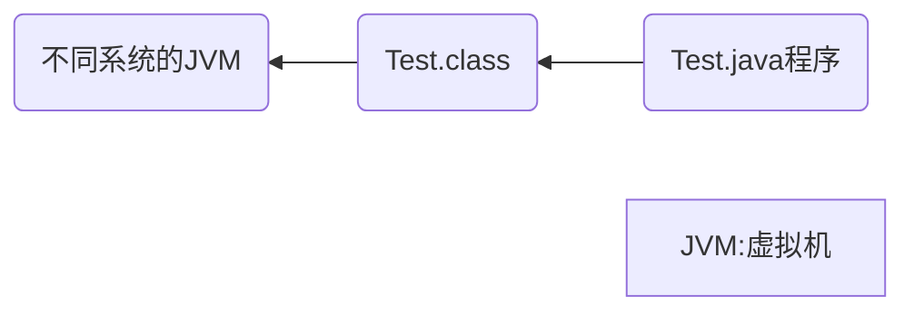

# Java基础学习

> 1. 初步认识Java，学会编写程序
> 2. 与C++进行比较学习，快速学完基础
> 3. 面向对象（三大特性：继承、封装、多态）
> 4. 异常处理
> 5. 常用类
> 6. 

## 第一章

---

### Java语言重要特点

> **面向对象的（Oop）**
>
> **健壮的**
>
> > 强类型机制、异常处理、垃圾的自动收集等,  提供了一个相对安全的内存管理和访问机制
>
> 简单性
>
> > Java就是C++语法的**简化版**,我们也可以称之为**C++--**
> >
> > 如:头文件,指针运算,结构,联合,操作符重载,虚基类等
>
> **跨平台性的**
>
> > 即一个编译好的.class文件可以在多个系统下运行
> >
> > ```mermaid
> > graph RL
> > 	A[Java语言是跨平台性的]
> > 	B(Test.java)-->C(Test.class)
> > 	C-->|运行|D(windows)
> > 	C-->|运行|E(Linux)
> > ```
>

> **解释型语言**
>
> > 如：Javascript、PHP、Java
>
> **编译型语言**
>
> > C/C++
> >
> > 区别：解释型语言编译后的代码不能直接被机器执行，需要解释器来执行，编译型语言可以直接执行
>
> **多线程**
>
> > 允许一个应用程序同时存在两个或两个以上的线程

---

### Java的开发工具

editplus、notepad++、Sublime Text、IDEA、eclipse

### Java运行机制及运行过程



说明：JVM（虚拟机）实现了Java程序在三个不同操作系统中的执行，提供了跨平台性

#### Java核心机制：Java虚拟机[JVM Java Virtual Machine]

> 1. **JVM**是一个虚拟的计算机，具有指令集并使用不同的存储区域。负责执行指令，管理数据、内存、寄存器，包含在**JDK**中
>
> 2. 不同平台需要安装不同的**JVM**
>
> 3. Java虚拟机机制屏蔽了底层运行平台的差别，实现了“**一次编译，到处执行**”
>
>    ```mermaid
>    graph LR
>    	A(Test.java)-->|javac编译|B(Test.class)
>    	B-->|java运行|C(JVM for Linux)
>    	B-->|java运行|D(JVM for Windows)
>    	B-->|java运行|E(JVM for MacOS)
>    ```

---

**JVM功能**

实现Java程序的跨平台性

> 有Java虚拟机只需要编写m+n种编译器和解释器,面向**JVM**编程

自动的内存管理(内存分配,内存回收)

> - **Java**程序在运行过程中,涉及到运算的**数据分配,存储**都由**JVM**完成
>
> - **Java**消除了程序员回收无用内存空间的职责.提供了一种**系统级线程跟踪存储空间分配情况**的能力,在内存空间达到相应阈值时,自动检查并释放可以被释放的存储器空间
>
> - **GC**的自动回收,提高了内存空间的利用效率,也提高了编程人员使用的效率,很大程度上**减少了**因为没有释放空间而导致的**内存泄漏**
>
>   > **Java**程序仍然存在内存溢出和内存泄漏的问题

---

### 认识JDK、JRE

#### JDK基本介绍

1. JDK的全称：Java Development Kit / Java开发工具包

   JDK = JRE + Java开发工具（Java、javac、javadoc、javap等）

2. JDK提供给Java开发人员使用，JDK包含JRE

#### JRE基本介绍

1. JRE（Java Development Kit / Java开发工具包）**JRE = JVM + Java的核心类库**
2. 如果只想运行一个开发好的Java程序，计算机中只需要安装JRE即可

#### Java版本

JavaSE / J2SE（标准版）

JavaEE / J2EE（企业版）

JavaME / J2ME（小型版）

#### 总结

1. JDK = JRE + 开发工具集（例如Javac、Java编译工具等）
2. JRE = JVM + Java SE标准类库
3. JDK = JVM + Java SE标准类库 + 开发工具集
4. 如果只想运行开发好的.class文件，只需要JRE

---

### Java中高级程序员学习路线图


---

### 配置PATH环境变量

> > JDK17自动配置环境变量，JDK8需手动配置

##### 配置方案一

> 1. 复制 **JDK **的bin目录路径 A:\B\C\bin
> 2. 配置环境变量，新建用户或系统的环境变量
> 3. 将bin目录地址添加并上移
> 4. 重启cmd并测试

##### 配置方案二

> 1. 新建系统变量名 JAVA ——HOME
> 2. 修改变量值为 A:B\C //C为 **JDK** 的文件路径
> 3.  编辑环境变量，添加**%JAVA_HOME%\bin**并上移
> 4. 重启cmd并测试
>
> > 为了方便后续Java高级内容学习，建议使用配置方案二

---

### Java语法教学


定义**main**方法

```java
public static void main(String[] args) {
    
}
// mian方法的格式是固定的
```


输出 `Hello World`

```java
public static void main(String[] args) {
    system.out.println("Hello World");
}
```

---

**定义主类**

> 主类定义了Java程序的执行起点，程序运行时会从主类的**main方法**开始执行

```java
public class Main {
    public static void main(String[] args) { //可以写成main(String args[])
        // 主类的入口点，程序从这里开始执行
        System.out.println("Hello, World!"); // 输出 Hello, World!
    }
}
//args:arguments
```

> > Java严格区分大小写


从控制台输出数据并换行

```java
System.out.println("###");
```

---

**注释**

单行注释

```java
// 单行注释
```

多行注释

```java
/*
多行注释
多行注释
*/
```

文档注释 `Java特有`

```java
/**
	@author 指定Java程序的作者
	@version 指定源文件的版本
	......
*/
```

> > **文档注释内容**可以被JDK提供的工具**Javadoc**所解析,生产一套以网页形式体现的该程序的说明文档
>
> ```java
> /**
> 
> 说实话我不是很想写文档注释,这太麻烦了,事实上我认为这应该是ChatGPT该干的事
> 
> @author uncle_yumo
> @version 1.123
> uncleyumo@123.com
> 
> */
> ```
>
> 生产文档注释的网页文件
>
> > ```cmd
> > javadoc -d mydir -author -version Main.java
> > ```
> >
> > 

**Java API 文档**

##### 案例一: 个人信息输出

```java
class PersonalInfo {
    public static void main(String args[]) {
        System.out.println("姓名: 康师傅");
        System.out.println("性别: 沃尔玛便利袋");
        System.out.println("家庭住址: 北京市朝阳区朝阳派出所");
    }
}
```

---

##### 第一章随堂复习与企业真题

1. 一个源文件中可以声明多个类,但是最多只能有一个类使用public进行声明.且要求声明为public的类的类名与源文件名相同.

2. Java的优势

   > - 跨平台性
   > - 安全性高
   > - 简单性
   > - 高性能
   > - 健壮性
   > - 面向对象性
   >
   > > 社区繁荣,开源框架众多,开发者数量庞大

3. 如何看待Java是一门半编译半解释型语言

   > ```mermaid
   > graph LR
   > 	A(Java源码 / ###.java)-->|生成|B[词法分析]
   > 	B-->C[语法分析]
   > 	C-->D[语义分析]
   > 	D-->E[字节码生成器]
   > 	E-->|生成|F(字节码 / ###.class)
   > ```
   >
   > ```mermaid
   > graph LR
   > A(字节码)-->B[类加载器]
   > B-->C[字节码验证器]
   > C-->D(解释器 / 解释执行)
   > C-->F(JIT编译器 / 编译执行)
   > D-->G[机器码]
   > F-->G
   > G-->H(操作系统)
   > ```

   ## 第二章

   ### 数据类型

   **基本数据类型(8种)**

   > - 整型: byte(1B) \ short(2 B) \ int(4 B) \ long(8 B)
   > - 浮点型: float \ double
   > - 字符型: char
   > - 布尔型: boolean
   
   **引用数据类型**

   > - 类(class)
   > - 数组(array)
   > - 接口(interface)
   > - 枚举(enum)
   > - 注解(annotation)
   > - 记录(record)
   
   ---

   **基本数据类型变量间的运算规则**

   > 自动类型提升
   >
   > ```java
   > // 规则:当容量小的变量与容量大的变量做运算时,结果自动转换为容量大的数据类型
   > // 容量指表示数据范围的大小而非所占内容空间的大小
   > byte ---> short ---> int ---> long ---> float ---> double
   > // byte与short类型变量做运算,结果为int类型
   > ```
   >
   > 强制类型提升
   >
   > ```java
   > 
   > ```
   
   ### 位运算符 (难点非重点)

   **基本语法** 位运算符针对数值类型常量进行计算.运算结果也是数值

   > **左移 <<**
   >
   > ```java
   > // 一定范围内,每向左移动一位,原数值*2,对于正负数都适用
   > int num = 2;
   > System.out.println(num << 2);
   > // 结果:8
   > 
   > int aunm = -2;
   > System.out.println(anum << 2);
   > // 结果:-8
   > ```
   >
   > > **面试题**: 用高效的方式计算 2 * 8
   > >
   > > > 2 << 3 或者 8 << 1
   >
   > **右移 >>**
   >
   > ```java
   > // 一定范围内,每向右移动一位,原数值/2,正负数通用
   > ```
   >
   > > **问题**: 如何交换两个int型变量的值, String呢?
   > >
   > > ```java
   > > // 交换两个int型变量的值
   > > class Exchange {
   > >  public static void main(String args[]) {
   > >      int m = 10;
   > >      int n = 20;
   > >      // 交换
   > >      int temp = 0;
   > >      temp = 10;
   > >      m = n;
   > >      n = temp;
   > >      System.out.println("m = " + m + ", n = " + n);
   > >  }
   > > }
   > > 
   > > // 方式二
   > > class Exchange2 {
   > >  public static void main(String args[]) {
   > >      int m = 10;
   > >      int n = 20;
   > >      // 交换
   > >      m = m + n;// m = 10 + 20 = 30
   > >      n = m - n;// n = 30 - 20 = 10
   > >      m = m - n;// m = 30 - 10 = 20
   > >      System.out.println("m = " + m + ", n = " + n);
   > >  }
   > > }
   > > 
   > > // 方法三
   > > class Exchange3 {
   > >  public static void main(String args[]) {
   > >      int m = 10;
   > >      int n = 20;
   > >      // 交换
   > >      m = m ^ n;
   > >      n = m ^ n;
   > >      m = m ^ n;
   > >      // 看不懂，真的，脑瘫才这么写
   > >      System.out.println("m = " + m + ", n = " + n);
   > >  }
   > > }
   > > ```
   > >
   > > ```java
   > > // 交换两个String类型变量的值
   > > class Exchange {
   > >  public static void main(String args[]) {
   > >      String m = "Hello";
   > >      String n = "World";
   > >      // 交换
   > >      String temp = "";
   > >      temp = m;
   > >      m = n;
   > >      n = temp;
   > >      System.out.println("m = " + m + ", n = " + n);
   > >  }
   > > }
   > > ```
   > >
   
   ---
   
   ##### 第二章随堂复习与企业真题
   
   1. 关键字、保留字
   
      - 关键字：被Java赋予特殊含义的字符串，官方规范中有50个，不包含true，false，null（可看作关键字）
      - 保留字：goto，const
   
   2. 标识符命名规则
   
      - 包名
   
        > 多单词组成时所有字母都小写：xxxyyyzzz
        >
        > 例如：java.lang , com.fuckyou.bean
   
      - 变量名，方法名
   
        > 多单词组成时，第一个单词首字母小写，第二个单词开始每个单词首字母大写：xxxYyyZzz
        >
        > 例如：age , name , bookName , main , binarySearch , getName
   
      - 类名，接口名
   
        > 多单词组成时，所有单词的首字母大写：XxxYxxZzz
        >
        > 例如：HelloWorld，String，System
   
      - 常量名
   
        > 所有字母都大写。多单词时每个字母都用下划线连接：XXX_YYY_ZZZ
        >
        > 例如：MAX_VALUE , PI , DEFAULT_CAPACITY
   
   3. 测试字符型和布尔型
   
      - 声明long类型变量时，需要提供后缀。后缀为`l`或`L`
   
        ```java
        long num_long = 123123123l // 123123123L
        ```
   
      - 声明float类型变量时，需要提供后缀`f`或`F`
   
        ```java
        float f1 = 12.3f // 12.3F
        ```
   
      - 实际开发中的浮点型通常用double
   
      - 通过测试发现浮点型变量的精度不高时，则需要使用BigDecimal类替换浮点型变量
   
      - boolean类型在实际的内存分配中，占用4个字节
   
   4. 取模 / 取余
   
      ```java
      int i = 12;
      int j = 5;
      System.out.println("i % j"); // 结果：2
      ```
   
   **企业真题**
   
   1. &与&&的区别
   
      > &为位运算符，&&为逻辑运算符
      >
      > &左右两边都会计算，而&&当左侧为false则直接输出false，省去右边计算
   
   2. Java中有8中基本数据类型，不包括String，String属于引用类型
   
   3. Java开发中计算金额需要使用BigDecimal类，可以实现任意精度的数据运算
   
   4. int i = 0; i = i++; 执行后i的值仍为0
   
   5. 如何将两个变量的值互换
   
      > ```java
      > String s1 = "abc";
      > String s2 = "123";
      > 
      > String temp = s1;
      > s1 = s2;
      > s2 = temp;
      > ```
   
   6. boolean占几个字节
   
      > 编译时不谈几个字节
      >
      > 但是在JVM给boolean类型分配内存空间时，boolean类型的变量占据一个槽位（slot，等于4个字节）
      >
      > 细节：true：1 ；false：0
      >
      > 拓展：在内存中，byte/short/char/boolean/int/float/占用1个slot；double/long占用2个slot
      >
   
   7. 为什么Java中**0.1+0.2**结果不是**0.3**
   
      包括JavaScript、Ruby、Python、Swift和Go等语言都使用**IEEE 754标准**（电气电子工程师学会）
      
      > 整数变为二进制，能够做到”每个十进制整数都有对应的二进制数“
      >
      > 对于小数，无法做到”每个小数都有对应的二进制数字“
      >
      > 因此，遇见小数的情况，比如开发银行、交易等系统，可以采用**四舍五入**或者**同乘同除**等方式进行验证

## 第三章

### 流程控制

**if-else**

```java
//格式1
if(a==b) {
    System.out.println("Format 1");
}

//格式2
if(a==b) {
    System.out.println("aaa");
}else {
    System.out.println("bbb");
}

//格式3
if(a==b) {
    System.out.println("aaa");
}else if {
    System.out.println("bbb");
}else if {
    System.out.println("ccc");
}else {
    System.out.println("ddd");
}
```

**使用Scanner类从键盘获取数据**

```java
//导包
import java.util.Scanner;
//创建Scanner类型的对象
Scanner scan = new Scanner(System.in);
//调用Scanner类的相关方法(next() / nextXxx()),来获取指定类型的变量

//取第一个位置的字符
scan.next().charAt(0) 


//释放资源 scan在控制台被使用，如果不主动回收将会被GC忽略回收，造成内存泄漏
scan.close();

//注意：需要根据相应的方法，来指定类型的值。如果输入的数据类型与要求的类型不匹配时，会报异常导致程序终止
```

> Scanner类中提供了获取byte\short\int\float\double\boolean\String类型变量的方法，但没有提供获取char类型变量的方法，需要使用next().charAt(num)来获取

