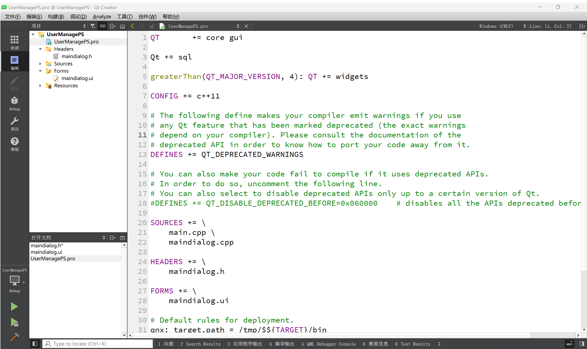
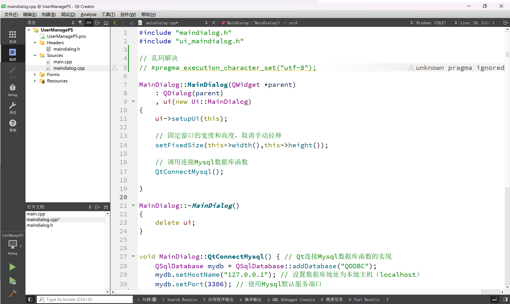
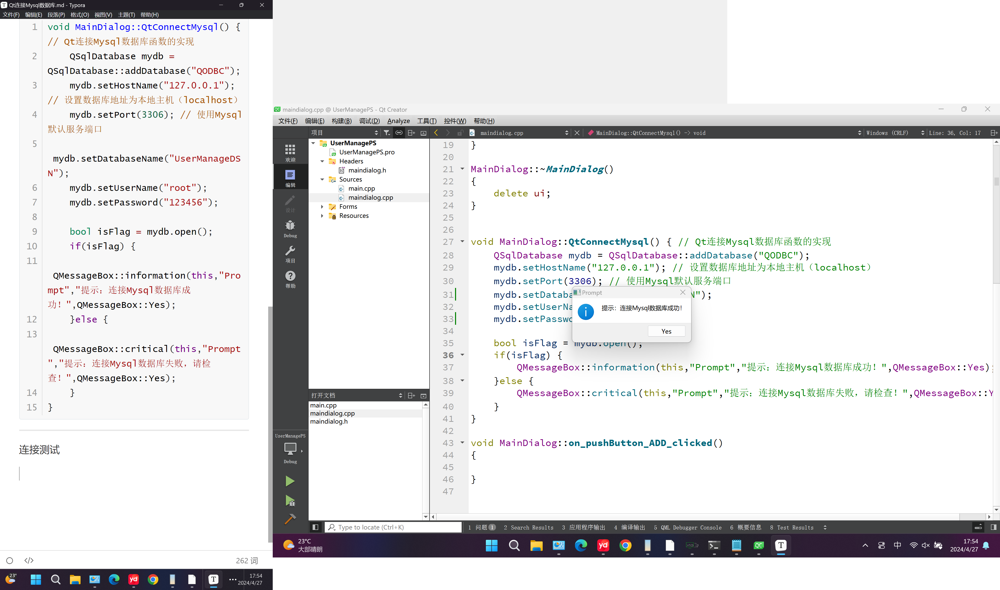
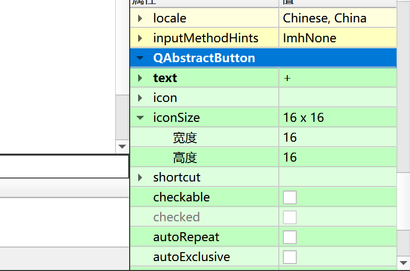
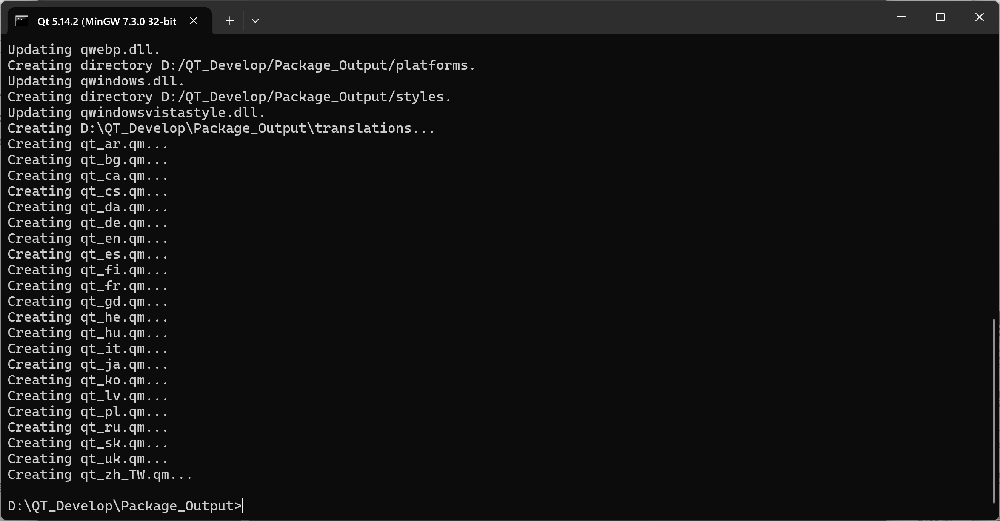
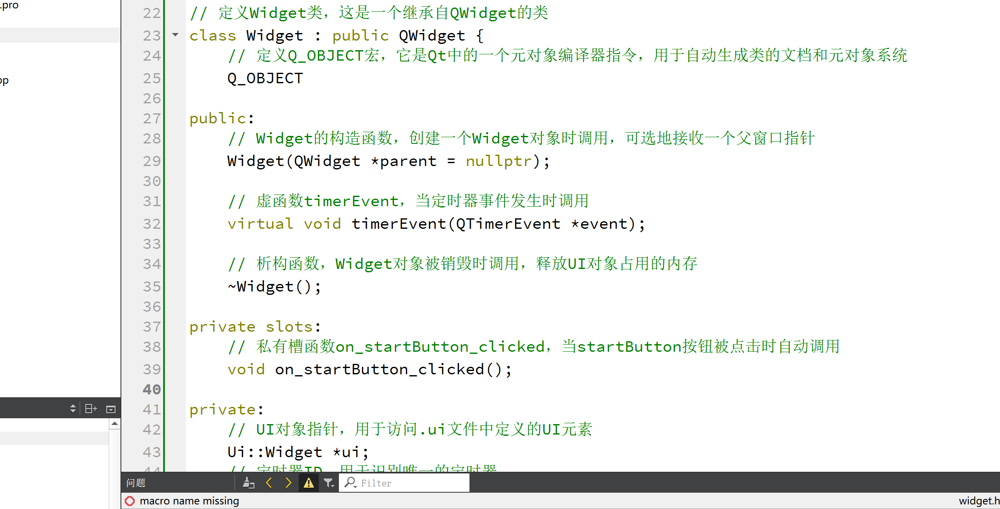
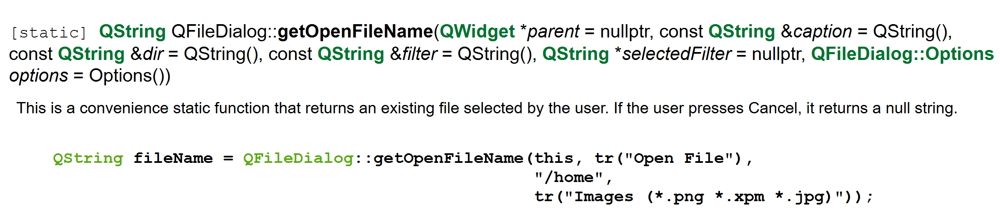
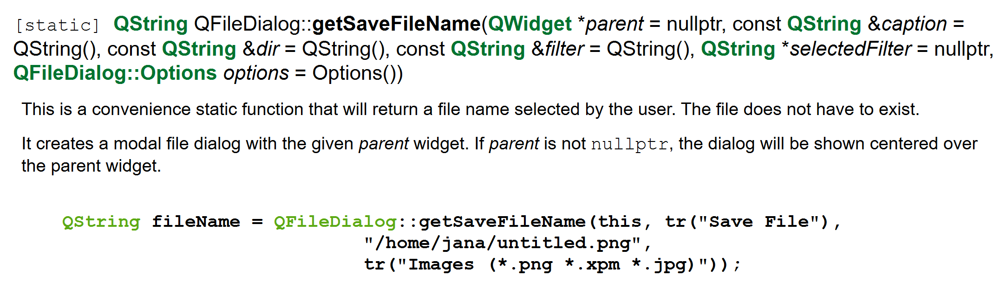

# Qt基础操作指南

> @author uncle_yumo
>
> @data 2024年4月29日
>
> @website revolicise.tech
>
> @quick_reference [引用文献](https://segmentfault.com/a/1190000022789064) 感谢博主[君的名字](https://segmentfault.com/u/jundemingzi)提供QMessage消息框使用部分的教程

##  -- 初始文件的详细说明

#### widget.h

```cpp
// 开头是条件编译指令，它确保Widget_h头文件只被包含一次。
#ifndef WIDGET_H
#define WIDGET_H

// 包含Qt的基类QWidget的头文件。QWidget是Qt框架中的基础窗口类。
#include <QWidget>

// 开始Qt命名空间的使用，这使得可以直接使用Qt框架中的类和函数，而不需要前缀。
QT_BEGIN_NAMESPACE

// 定义一个名为Widget的类，它继承自QWidget。这将是用户界面的主要窗口类。
namespace Ui {
class Widget; // 声明Ui::Widget类，但不定义它。这个类通常包含用户界面的元素。
}

// 结束Qt命名空间的使用。
QT_END_NAMESPACE

// Widget类使用Q_OBJECT宏，它是Qt中meta-object系统的宏，用于自动生成类的元对象，如对象的唯一标识符和序列化支持。
class Widget : public QWidget {
Q_OBJECT

// 公共构造函数，创建一个Widget对象，可选的父窗口参数是QWidget *parent。
public:
Widget(QWidget *parent = nullptr);

// 析构函数，用于清理Widget对象及其资源，如删除UI对象等。
~Widget();

// 类中私有槽函数的声明区域，响应用户操作
// 由于槽函数声明为 private，它们只能在类的成员函数中被调用。这保证了槽函数的封装性，并且只有类本身知道如何正确地处理这些槽函数。
private slots:

// 私有成员变量，指针指向Ui::Widget类的实例，它包含和管理用户界面元素。
private:
Ui::Widget *ui;
};

// 条件编译指令的结束，确保Widget_h头文件内容的完整性。
#endif // WIDGET_H

```

---

#### main.cpp

```cpp
/* 包含widget.h头文件，
 * 这个头文件通常包含了定义一个Qt Widget应用程序所需的基本类和函数。 */
#include "widget.h"

/* 包含Qt的QApplication类头文件，
 * QApplication是Qt应用程序框架的核心类之一，
 * 用于管理应用程序的生命周期，如创建和运行事件循环。*/
#include <QApplication>


/* main函数是Qt应用程序的入口点，
 * argc表示命令行参数的数量，
 * argv是一个指向参数字符串数组的指针。*/
int main(int argc, char *argv[]) {

    /* 创建一个QApplication实例a，
     * 并传入命令行参数argc和argv。
     * 这行代码会初始化Qt的应用程序对象，
     * 并设置事件处理程序。 */
    QApplication a(argc, argv);

    // 创建一个Widget类的实例w。Widget是Qt中用于创建图形用户界面的基类。
    Widget w;

    // 调用实例w的show方法，这将使得w的窗口显示出来。
    w.show();

    /* 返回a的exec方法的结果，
     * 这将使得应用程序进入事件处理循环，
     * 等待事件发生并处理它们，直到应用程序关闭。 */
    return a.exec();

}
/* main函数的结束。 */
```

---

#### widget.cpp

```cpp

// 引入头文件widget.h，这个文件包含了类的声明和成员函数的定义
#include "widget.h"

// 引入头文件ui_widget.h，这个文件包含了UI界面的定义，通常包含了用户界面元素如按钮、文本框等的声明
#include "ui_widget.h"

// Widget类构造函数的定义
// QWidget *parent - 父窗口指针，用于实现窗口的层级关系
Widget::Widget(QWidget *parent)
    : QWidget(parent) // 调用基类QWidget的构造函数，创建一个QWidget对象
    , ui(new Ui::Widget) // 创建一个Ui::Widget类型的指针，这个类型通常在.ui文件中自动生成
{
    ui->setupUi(this); // 使用ui指针调用setupUi函数，根据.ui文件中的布局和控件设置当前窗口(this指针指向当前的Widget对象)的界面
}

// Widget类析构函数的定义
// 在对象生命周期结束时调用，用于执行清理工作
Widget::~Widget()
{
    delete ui; // 删除ui指针指向的内存，避免内存泄漏
}
```

## -- 三种常用界面说明

>  三个常用类（Qwidget类、QDialog类、QMainwindow类）

1. **Qwidget类：**

​		继承与QObject类和QPaintdevice类，所有用户界面对象的基类，常用于		嵌入到其他窗体的界面；

2. **QDialog类：**

​		继承与QWeidget类，对话框窗口的基类，用于创建顶级对话框；

3. **QMainwindow类：**

​		继承与QWeidget类，菜单、工具、状态条的主应用程序窗口。

---

## -- 常用快捷键说明

1. 预览设计窗口：`Alt + Shift + R`
2. 运行项目：`Ctrl + R`

---

## -- 连接信号与槽

#### 通过connect()完成

> example：创建按钮`pushButton_Test`与行文本输入框`lineEdit_Test`

```cpp
SignIn_Page::SignIn_Page(QWidget *parent) :
    QDialog(parent),
    ui(new Ui::SignIn_Page)
{
    ui->setupUi(this);
    // 连接信号与槽 conncet接收四个参数：谁发出信号、发出什么信号、谁处理信号、怎么处理信号
    connect(ui->lineEdit_Test, // 信号源
            SIGNAL(returnPressed()), // 信号类型，此处returnPrecess()为回车
            this, // 谁处理信号
            SLOT(on_pushButton_Test_clicked)); // 处理结果为调用按钮pushButton_Test
}
```

#### 通过地址调用完成

> 设置取消按钮`cancelButton`，实现窗口的关闭：`this.close`

1. 在窗口头文件中定义取消按钮点击事件的槽函数声明 maindialog.h

   ```cpp
   #ifndef MAINDIALOG_H
   #define MAINDIALOG_H
   
   QT_BEGIN_NAMESPACE
   namespace Ui { class MainDialog; }
   QT_END_NAMESPACE
       
   class MainDialog : public QDialog
   {
       Q_OBJECT
   public:
       MainDialog(QWidget *parent = nullptr);
       ~MainDialog();
       
   private slots:
   	// 声明取消按钮的点击事件
       void on_cancelButton_clicked();
   private:
       Ui::MainDialog *ui;
   };
   #endif // MAINDIALOG_H
   ```

2. 在窗口cpp文件中实现函数 maindialog.cpp

   ```cpp
   void Widget::on_cancelButton_clicked() {
       this.close();
   }
   ```

3. 连接按钮信号和槽函数 maindialog.cpp

   ```cpp
   SignIn_Page::SignIn_Page(QWidget *parent) :
       QDialog(parent),
       ui(new Ui::SignIn_Page)
   {
       ui->setupUi(this);
       
       // 连接信号与槽
       connect(ui->cancelButton,&QPushButton::clicked,this,&Widget::on_cancelButton_clicked);
   }
   ```

   

---

## -- QMessage消息框使用

> QT的QMessageBox类提供了一个模式对话框，用于通知用户或询问用户问题并接收答案。

使用QMessageBox需要：

- 添加库`QT += widgets`
- 包含相关头文件`#include <QMessageBox>`

通过查看QT[官方文档](https://link.segmentfault.com/?enc=BUcnWFECBzDahci%2FFXaq5g%3D%3D.skasQppzXhZvsOgqXyS21LgRXEEtRPbui27mcxEG%2BR4OsO1eXd%2Bei1LvLJGVqHXk)找到QMessageBox的静态成员函数，可以看到其函数声明。

| 返回值                        | 函数名及参数                                                 |
| ----------------------------- | ------------------------------------------------------------ |
| `void`                        | [about](https://link.segmentfault.com/?enc=E7JYodMplLjv7bLdxDHVYg%3D%3D.rPRJUH5LoG0pu1bAJEr65zhuK%2Bjxf2IHz%2BJhDXM6ddhoxbiNu%2BVmNnuDJAEmFNJh)(QWidget *parent, const QString &title, const QString &text) |
| `void`                        | [aboutQt](https://link.segmentfault.com/?enc=qu1PLw18fpp9USgGLbfH2A%3D%3D.ApH5mu0s5yRvWCBDf9OWxXJl8T4u5j6fU%2FRbdq0nRSyo8NOeTbwvxtThECZ5SeiX)(QWidget *parent, const QString &title = QString()) |
| `QMessageBox::StandardButton` | [critical](https://link.segmentfault.com/?enc=m2xCmWek0IR7cJAsFD67YQ%3D%3D.BgUBDuoPtWg66VZx1GIVD5011Lzf5M8QIqPrPUGDZ0kgcETcctSRWNV1IyYVNQ3R)(QWidget *parent,const QString &title,const QString &text,QMessageBox::StandardButtons buttons = Ok, QMessageBox::StandardButton defaultButton= NoButton) |
| `QMessageBox::StandardButton` | [information](https://link.segmentfault.com/?enc=Z2Y4ZuRV3Ol%2FooLE%2F4VXtQ%3D%3D.xBz8ZZH%2FyfTprf%2Fogz9%2BS9TAqFBHIUJqilNrhUTr8k%2BWyHf9jPwVE3xHrv%2FdJAnm)(QWidget *parent,const QString &title,const QString &text,QMessageBox::StandardButtons buttons = Ok,QMessageBox::StandardButton defaultButton= NoButton) |
| `QMessageBox::StandardButton` | [question](https://link.segmentfault.com/?enc=SHmSUusGktHUlFC5TUIMzw%3D%3D.AHmHrAGnQ0AA%2FHZDGu%2F%2FgCGD6J4SjcUzJTqKUYBpaUcz%2BOLwCxE2lKQCLEDel0bH)(QWidget *parent,const QString &title,const QString &text,QMessageBox::StandardButtons buttons =StandardButtons(Yes\|No),QMessageBox::StandardButton defaultButton= NoButton) |
| `QMessageBox::StandardButton` | [warning](https://link.segmentfault.com/?enc=n0LgIysri3Pqv280Z75%2F2g%3D%3D.wFZgdtiHJgGVTjTzfJZnZ%2B0cF41dOC%2FHUnjrn4mCHbN7%2BWV8Pd2cYN8uJnn%2BLSNd)(QWidget *parent,const QString &title,const QString &text,QMessageBox::StandardButtons buttons = Ok,QMessageBox::StandardButton defaultButton= NoButton) |

总的来说，标准消息对话框QMessageBox类有六种消息框。

| 静态函数                 | 函数说明          |
| ------------------------ | ----------------- |
| QMessageBox::question    | Question消息框    |
| QMessageBox::information | Information消息框 |
| QMessageBox::warning     | Warning消息框     |
| QMessageBox::critical    | Critical消息框    |
| QMessageBox::about       | About消息框       |
| QMessageBox::aboutQt     | AboutQt消息框     |

标准按钮的标志`QMessageBox::StandardButton`

| 内容                         | 描述                                                         |
| ---------------------------- | ------------------------------------------------------------ |
| QMessageBox::Ok              | [AcceptRole](https://link.segmentfault.com/?enc=yt8JQAJW%2Be8k9Ul1B8KZxw%3D%3D.XWTwz1M3l%2F6xTVMCMT5Pv7eQVRJ0YvwpUU6GIP3k9cKtir3sFZQKg7MO8HTf9Rvs)定义的“确定”按钮。 |
| QMessageBox::Open            | [AcceptRole](https://link.segmentfault.com/?enc=e8Z8ehUp7bVMyo68g7nxww%3D%3D.iZq9Hg359q3iKZvSQ41QbQMD4hyb%2FC81jcpXPdarejNm%2F6EBpLeEVa2jEcImFYiw)定义的“打开”按钮。 |
| QMessageBox::Save            | [AcceptRole](https://link.segmentfault.com/?enc=w0zAwm%2FDQX8Bffi9MDe6xA%3D%3D.IJsU4a518Qt1WV9YoZXBXu29wPbgeJhVsJ6rPHCFAgGNpy4TTG2wpTfCVAXcfXRi)定义的“保存”按钮。 |
| QMessageBox::Cancel          | [RejectRole](https://link.segmentfault.com/?enc=ncyWCFLnIORVxEKWMsCENQ%3D%3D.C5kTDAVRfNpgZYi55AuzQrWOFWJUgeBcARa00iGva4au89j6bwL17m4kHfwbqPh5)定义的“取消”按钮。 |
| QMessageBox::Close           | [RejectRole](https://link.segmentfault.com/?enc=uZELvPNYcPvdvPxl2nKNLQ%3D%3D.PDNByriFBksCOtrGMkUwxHfCwZpxUvtZvCi%2FDlghb1DjhrIbj9ICs7pE%2FVALjLeN)定义的“关闭”按钮。 |
| QMessageBox::Discard         | [DestructiveRole](https://link.segmentfault.com/?enc=GjILEDGX9wYuTDnug4I0Wg%3D%3D.qA65Z3c4zlhJB76SeysJBWLiTHU8Nuo%2BXE3xbyND6AJ4FsLIR%2FHiNnqFunmq18Hn)定义的“放弃”或“不保存”按钮。 |
| QMessageBox::Apply           | [ApplyRole](https://link.segmentfault.com/?enc=LJP%2FK2afR%2BZqPQg2A7m1gw%3D%3D.lsvG%2Btk8NAwStwUOIvralp9rMW6hfDQmUNeP2nb1l1MLWA%2BPor%2BZnAsqX2rb2fNm)定义的“应用”按钮。 |
| QMessageBox::Reset           | [ResetRole](https://link.segmentfault.com/?enc=%2FOnCqIH28SJv5U0odBaVtg%3D%3D.Pv6lFddDUR5pApe%2FyendTGKEj%2FOfttPbolxe4Bc9DsYodeq4LVApRiisEMN9Ave5)定义的“重置”按钮。 |
| QMessageBox::RestoreDefaults | [ResetRole](https://link.segmentfault.com/?enc=YJg6YFaurAQs3Z%2BOg5QYKA%3D%3D.613%2FQv9fOiOfCPhc3Azxan1A7QliwfSEeUrbM72Y1pQafAJDhzFvG9vWZe%2B%2Fzqv8)定义的“恢复默认值”按钮。 |
| QMessageBox::Help            | [HelpRole](https://link.segmentfault.com/?enc=R8Yv%2FVRWD98q%2F0GCxXRGeA%3D%3D.MEDsmGqa0OuRqA4udTSw8%2FmqreKEbEplPdmbylXMY%2FDGxE6MqhfViENQSpTqAyL%2B)定义的“帮助”按钮。 |
| QMessageBox::SaveAll         | [AcceptRole](https://link.segmentfault.com/?enc=ITMZ1AG08pa9pkb9UPxo3A%3D%3D.t46B%2FDfIhC8vGUNl70lKcX%2FtubkGI0ExjQJLNmjQaXqVus5xkdAzLDw0W6fbm1%2Fm)定义的“全部保存”按钮。 |
| QMessageBox::Yes             | [YesRole](https://link.segmentfault.com/?enc=s%2FMzEmpVFDndF1pzE%2FDzNA%3D%3D.i2p0k%2B7WPtyRHkDyx884l0N3dcVfYDJp4oQm47VP9s8cjkQkREOfIxZb%2B%2FHsEdOJ)定义的“是”按钮。 |
| QMessageBox::YesToAll        | [YesRole](https://link.segmentfault.com/?enc=qP6jA%2BpDqAO2MixWtj04uA%3D%3D.skv37EGmw3EHmhcyz3LyprtHrvnslGYP56FNwdGHBDkxY1w5qtcWWFzh0t85ib8o)定义的“全部同意”按钮。 |
| QMessageBox::No              | [NoRole](https://link.segmentfault.com/?enc=a7c7RWVyD6EJ2vqHSwmRCw%3D%3D.Z6V1D%2BPIeUeSxmbK%2B9PqmIOeIfXcW8cD1aIyeMiluOz7FI3Oah7opAEneOEUPvGJ)定义的“否”按钮。 |
| QMessageBox::NoToAll         | [NoRole](https://link.segmentfault.com/?enc=LEQEyrgUETfPVmCPfhdC%2FQ%3D%3D.nRm4Uc1aHxBgv8DSdk2VgHCF1wN96IQAVP7du9Qn5tx7oubN53WlqTXivmZn4BTY)定义的“全部拒绝”按钮。 |
| QMessageBox::Abort           | [RejectRole](https://link.segmentfault.com/?enc=0a730Awwk5E0yjYgD%2BAxSg%3D%3D.wF%2F7dkd4TR6zYqujmmiN6UoQbXw9RMaWThOwyXy0tZ46ZEBICktOAsIsC0YUG31L)定义的“中止”按钮。 |
| QMessageBox::Retry           | [AcceptRole](https://link.segmentfault.com/?enc=r5xVOLJ04Knioze8PS2PwA%3D%3D.x3%2F0WOysVCejRL%2FUOUICvZqfuMYjz4g0wFD3DpQw30UrxuDPWOS2eM5fVaqRXirz)定义的“重试”按钮。 |
| QMessageBox::Ignore          | [AcceptRole](https://link.segmentfault.com/?enc=MvxjIehvXo57PRoIO75ojQ%3D%3D.shLmAx6N2tW8sYUTqPyVrJ7lIR21pCPdy1GKIwovb5VeKQx5eHJS1bu4y11ktF%2F2)定义的“忽略”按钮。 |
| QMessageBox::NoButton        | 无效的按钮。                                                 |

消息严重级别

|  | [Question](https://link.segmentfault.com/?enc=uOVB8jBZ2SvNclh%2BUyZf7w%3D%3D.DCOdwZqLWZbz%2FIABlaw9Wjy5CCI1p4Dd%2F2PJdr527MXi138xpbYzf7LQvqdv5nuqpU%2FSETxLtn8pT29jq%2BeyPA%3D%3D) | 用于在正常操作期间提出问题。 |
| ------------------------------------------------------------ | ------------------------------------------------------------ | ---------------------------- |
|  | [Information](https://link.segmentfault.com/?enc=Nm4xS%2F4bwEcRTgyxfEVIbw%3D%3D.wWz%2BF3qctbkx%2FWTZ5ghwEbHfie2N6PgriBAbIpsGjKXuln6vvti6q6ny2rtL8qqUymQ3fsQRqUUq%2BQEBpHSWUg%3D%3D) | 用于报告有关正常操作的信息。 |
|  | [Warning](https://link.segmentfault.com/?enc=rv4R3gyLH4bF%2FXA8yoyZmA%3D%3D.0bkyuz8T1KnsUJDaqAHARBsy%2FwuEk6K4CbxpDZaivX4kDOAKp7klfpl9cXQ7Kew5NVMzh7OOu53LK6eGjNI21w%3D%3D) | 用于报告非严重错误。         |
|  | [Critical](https://link.segmentfault.com/?enc=DnGoZP1DokmbvlbfS22CkQ%3D%3D.dL%2BUQnm3CJPGltACPkzzzHqdL2jIvuzXSoXCE1gVTr%2FQA605l1jleKELDuOTK9tt4oVFS9LhQWZkZI6li9Wp2g%3D%3D) | 用于报告严重错误。           |

#### Question消息框

**函数声明：**

> `QMessageBox::StandardButton` [question](https://link.segmentfault.com/?enc=GAgmTEjxDLL3JX9RjEo97Q%3D%3D.NEjID%2BjOSWpxdZgKS5VvhQgMZXCTsY4TJFzI0%2FJqdUhOOOaFHAtmimzUC3Y5TVS1)(`QWidget` *parent,
> `const QString` &title,
> `const QString` &text,
> `QMessageBox::StandardButtons` buttons =StandardButtons(Yes|No),
> `QMessageBox::StandardButton` defaultButton= NoButton)

**示例代码：**

```cpp
 QMessageBox::question(this, 
        tr("弹窗标题"),
        tr("弹窗内容"),
        QMessageBox::Ok | QMessageBox::Cancel, 
        QMessageBox::Ok);
```

**效果：**


**解释：**

- 第四个参数buttons指要添加的标准按钮，置为`QMessageBox::Ok | QMessageBox::Cancel`表示添加确认键和取消键。
- 第五个参数defaultButton指定按下**Enter**键时使用的按钮，若为`QMessageBox::NoButton`则QMessageBox自动选择一个合适的默认值。。
- 函数返回类型为`QMessageBox::StandardButton`，可通过返回值知道用户按下了哪个按钮，以此作为后续操作依据。

#### Information消息框

Information消息框具有和Question消息框一样的参数和返回值，其使用方法和解释都是一样的。

```cpp
QMessageBox::information(this, 
    tr("Information消息框标题"), 
    tr("这是Information消息框的内容。"),
    QMessageBox::Ok | QMessageBox::Cancel, 
    QMessageBox::Ok);
```


#### Warning消息框

Warning消息框同上。

```cpp
    QMessageBox::warning(this, 
        tr("Warning消息框"),
        tr("您修改的内容还未保存，是否要保存对文档的修改？"),
        QMessageBox::Save | QMessageBox::Discard | QMessageBox::Cancel,
        QMessageBox::Save);
```


#### Critical消息框

Critical消息框同上。
在调用时，如果不指定后两个参数，即设置按钮和设置按下时的默认按钮。系统会默认指定。（上述四个消息框都一样。）

```cpp
QMessageBox::critical(this, tr("Critical消息框"), tr("这是一个Critical消息框！"));
```


#### About消息框

About消息框只能指定消息标题和内容，不能设置按钮。
它的函数声明：

> `void` [about](https://link.segmentfault.com/?enc=d22QEUUek2QzgSyyta19YA%3D%3D.HBR2JQhxqk13stoPmz%2F0wJVfiYJv86%2BK5F%2BGyTqFRsfYDjoSK52xk0bIvkzjDH1h)(`QWidget` *parent, `const QString` &title, `const QString` &text)

```cpp
QMessageBox::about(this, tr("About消息框"), tr("这是一个About消息框测试！"));
```


#### AboutQt消息框

AboutQt消息框显示了应用程序正在使用的Qt的版本号等信息。
它只能指定标题。其函数声明：

> `void` [aboutQt](https://link.segmentfault.com/?enc=AfDIhc1hvw09AVhweycwPw%3D%3D.Im9Q6AVfDaZFtETTk2sJcHbXSavQpTxi7kDx0lxOAQLv5z876DvAmYNMf4JvK0I2)(`QWidget` *parent, `const QString` &title = QString())

```cpp
QMessageBox::aboutQt(this, tr("About Qt消息框"));
```

在“ProjectName”.pro工程文件中加入sql模块

```java
QT += sql
```



---

## -- Qt连接Mysql数据库

在头文件“maindialog".h中添加数据库相关头文件

```c++
// 添加数据库有关头文件
#include <QSqlDatabase>

// 用户数据库的查询操作
#include <QSqlQuery>

// 取消省略数据库操作的报错
#include <QSqlError>

// 实现弹出警告信息 添加消息框头文件
#include <QMessageBox>
```

---

在头文件“maindialog".h中添加自定义数据库函数

```cpp
    // 自定义数据库函数
public:
    void QtConnectMysql(); // Qt连接Mysql数据库函数(类内声明、类外实现)
```

---

在"maindialog".cpp中实现自定义数据库函数

```cpp
void MainDialog::QtConnectMysql() { // Qt连接Mysql数据库函数的实现
    QSqlDatabase mydb = QSqlDatabase::addDatabase("QODBC");
    mydb.setHostName("127.0.0.1"); // 设置数据库地址为本地主机（localhost）
    mydb.setPort(3306); // 使用Mysql默认服务端口
    mydb.setDatabaseName("UserManageDSN");
    mydb.setUserName("root");
    mydb.setPassword("123456");

    bool isFlag = mydb.open();
    if(isFlag) {
        QMessageBox::information(this,"Prompt","提示：连接Mysql数据库成功！",QMessageBox::Yes);
    }else {
        QMessageBox::critical(this,"Prompt","提示：连接Mysql数据库失败，请检查！",QMessageBox::Yes);
    }
}
```

---

在"maindialog".cpp文件中调用自定义数据库函数

```cpp
MainDialog::MainDialog(QWidget *parent)
    : QDialog(parent)
    , ui(new Ui::MainDialog)
{
    ui->setupUi(this);

    // 固定窗口的宽度和高度，取消手动拉伸
    setFixedSize(this->width(),this->height());

    // 调用连接Mysql数据库函数
    QtConnectMysql();

}
```

---

解决字符集不匹配导致的乱码

在"maindialog".cpp中添加代码

```cpp
// 乱码解决
// #pragma execution_character_set("utf-8");
```



---

连接测试



---

## -- 简单的基本操作

#### 按钮添加图片

```cpp
// 创建图标对象
QIcon icon("图片路径") // 注意用'//'转义'/''
ui->Button->setIcon(icon)；
```

**设置icon图片大小**



---

#### 改变按钮背景色

```cpp
ui->Button->setStyleSheet("background:blue");
```

---

#### 删除字符串尾部n个字符

```cpp
QString str = "12345";
str = str.chop(2);
printf("str"); // 输出结果为：123
```

---

#### Qt程序打包成exe

> 打包成exe可执行程序

**具体步骤**

1. 打开QT Creator在release下运行 **( 确认生成器和位数版本 )**

2. 到**release**下找生成的**exe**文件

3. 将**exe**文件拷贝到一个空文件夹下

4. 在开始菜单中找到Qt 5.12.2 (MinGW 7.3.0 64-bit)命令行窗口 **( 版本和第一步选择的匹配 )**

5. 输入命令跳转到**exe**所在目录
   命令：`cd D:\QT_Develop\Package_Output`

6. 输入命令将所需的库文件全都拷贝到exe程序的当前目录
   命令：`windeployqt myQTApplication.exe`

   

7. 如果有引入的dll库，手动拷贝到make目录

   > 例如我的工程，引入了4个opencv的dll库文件，所以需要将这4个dll拷贝到make目录

8. 使用Engima Virtual Box进行封包

9. 打开Engima Virtual Box后选择待封包的**exe**主程序

10. 增加要封包的所有程序文件

11. 执行封包

12. 得到exe可执行程序

---

#### 自定义窗口名称

```cpp
// widegt.cpp的构造函数
Widget::Widget(QWidget *parent)
    : QWidget(parent)
    , ui(new Ui::Widget)
{
    ui->setupUi(this);
        
    // 所添加的代码
    this->setWindowTitle("窗口名称");
}
```

#### QObject定时器

>  在头文件中声明虚函数timerEvent()，当定时器事件发生时调用

```cpp
// 定义一个常量TIME_OUT，表示定时器的超时时间，这里是1秒（1000毫秒）
#define TIME_OUT 1 * 1000

-------------------------------
public:
    // Widget的构造函数，创建一个Widget对象时调用，可选地接收一个父窗口指针
    Widget(QWidget *parent = nullptr);

    // 虚函数timerEvent，当定时器事件发生时调用
    virtual void timerEvent(QTimerEvent *event);

    // 析构函数，Widget对象被销毁时调用，释放UI对象占用的内存
    ~Widget();

-------------------------------
private:
    // 定时器ID，用于识别唯一的定时器
    int myTimerId;

```



---

#### QTimer定时器

```cpp
#widget.h

// 组件信号处理函数定义
private slots:
void on_pushButton_start_clicked();
void timeoutSlot();

// 私有成员变量，指针指向Ui::Widget类的实例，它包含和管理用户界面元素。
private:
    Ui::Widget *ui;

    // 头文件中定义定时器timer
    QTimer * timer;
};
```

```cpp
#widget.cpp

// 构造函数
Widget::Widget(QWidget *parent)
    : QWidget(parent)
    , ui(new Ui::Widget) 
{
    ui->setupUi(this);
    
    // 创建了一个定时器对象
    timer = new QTimer; 
        
    // 连接信号与槽：定时器超时后，发出timeout信号
    connect(timer,  // timer发出信号
            &QTimeout, // 信号类型：取地址
            this, // 处理者：this
            &Widget::timeoutSlot); // 如何处理：timeoutSlot()
}
```

```cpp
#widget

// 按钮的槽函数
void Widget::on_pushButton_start_clicked()
{
    timer->start(1 * 1000); // 参数(params)为超时时间
}

// timeoutSlot()函数实现
void Widget::timeoutSlot() {
    // 接收到超时信号后触发的代码
}
```

```cpp
void Widget::on_pushButton_stop_clicked()
{
    timer->stop(); // 关闭定时
}
```

---

> 在槽函数中触发定时

```cpp
void Widget::on_startButton_clicked()
{
    // 开启定时器，返回定时器编号
    // TIME_OUT为超时时间
    myTimerId = this->startTimer(TIME_OUT);
}

// 超时后的动作
void Widget::timerEvent(QTimerEvent *event) {
    // 匹配定时器Id
    if(event->timerId() != myTimerId) {
        return;
    }
    // 超时后执行的代码
}
```

---

#### QPixmap载入图片至Label标签

```cpp
#Widget.cpp

    QPixmap pix(path); // path为图片路径
    ui->label->setPixmap(pix);
```

---

QImage载入图片至Label标签

```cpp
#widget.cpp

	QImage img;
    img.load("图片路径");
	ui->Label->setPixmap(QPixmap::fromImage(img));
```

---

#### 创建菜单栏按钮点击事件

1. 在**mainwindow.cpp**的MainWindow构造函数体中添加connect()方法

   > conncet()接收四个参数：谁发出信号、发出什么信号、谁处理信号、怎么处理信号
   >
   > 此处的 'connect连接信号与槽' 通过地址调用完成

   ```cpp
   #include "mainwindow.h"
   #include "ui_mainwindow.h"
   
   // 主菜单窗口构造函数
   MainWindow::MainWindow(QWidget *parent)
       : QMainWindow(parent)
       , ui(new Ui::MainWindow)
   {
       ui->setupUi(this);
       
       // 添加connect()连接信号与槽
       // 此处示例的触发事件为 '菜单栏的newAction被点击'
       connect(ui->newAction,&QAction::triggered,this,对应触发的槽函数());
   }
   
   MainWindow::~MainWindow()
   {
       delete ui;
   }
   
   ```

2. 在**mainwindow.h**的私有槽函数的声明区域声明所需的槽函数

   ```cpp
   #ifndef MAINWINDOW_H
   #define MAINWINDOW_H
   
   #include <QMainWindow>
   
   QT_BEGIN_NAMESPACE
   namespace Ui { class MainWindow; }
   QT_END_NAMESPACE
   
   class MainWindow : public QMainWindow
   {
       Q_OBJECT
   
   public:
       MainWindow(QWidget *parent = nullptr);
       ~MainWindow();
   
   // 'private slots:' : 私有槽函数的声明区域
   private slots:
       // 声明所需的槽函数
       void newActionSlot();
   
   private:
       Ui::MainWindow *ui;
   };
   #endif // MAINWINDOW_H
   
   ```

3. 在**mainwindow.cpp**中的构造函数体中替换connect()中对应触发的槽函数为`newActionSlot()`，并实现声明的槽函数

   ```cpp
   #include "mainwindow.h"
   #include "ui_mainwindow.h"
   
   // 主菜单窗口构造函数
   MainWindow::MainWindow(QWidget *parent)
       : QMainWindow(parent)
       , ui(new Ui::MainWindow)
   {
       ui->setupUi(this);
       
       // 添加connect()连接信号与槽
       connect(ui->newAction,&QAction::triggered,this,&MainWindow::newActionSlot);
   }
   
   MainWindow::~MainWindow()
   {
       delete ui;
   }
   
   // 实现声明的槽函数
   void MainWindow::newActionSlot() {
       // 槽函数所执行的代码
   }
   ```

---

#### 调用打开外部文件接口

> 所需方法：`getOpenFileName()`



1. 添加QFileDialog头文件

   ```cpp
   #include <QFileDialog>
   ```

2. 槽函数实现

   ```cpp
   // 调用打开外部文件接口的对应槽函数实现
   void MainWindow::openActionSlot() {
       QString filePath = QFileDialog::getOpenFileName(
           this, // 被打开窗口的父类对象
           tr("Open File"), // 指定窗口左上角Title
   
           // 默认打开文件的路径 获取当前路径：QCoreApplication::applicationFilePath()
           QCoreApplication::applicationFilePath(),
   
           tr("text_file(*.cpp *.h *.txt)")
        );
   
       if(filePath.isEmpty()) {
           QMessageBox::warning(this,"警告","请选择一个文件");
       }else {
           qDebug() << filePath;
   
           QFile file(filePath);
   
           file.open(QIODevice::ReadOnly);
   
           QByteArray ba = file.readAll();
   
           ui->textEdit->setText(QString(ba));
   
           file.close();
   
       }
   }
   ```

---

#### 调用保存内部文件接口

> 所需方法：`getSaveFileName()`



1. 添加QFileDialog头文件

   ```cpp
   #include <QFileDialog>
   ```

2. 槽函数实现

   ```cpp
   void MainWindow::saveActionSlot() {
       // 返回值filePath为此处创建的被保存对象的地址
       QString filePath = QFileDialog::getSaveFileName(
           this, // 被打开窗口的父类对象
           
           "选择一个文件", // 指定窗口左上角标题
           
           // 默认打开文件的路径，通过获取当前应用程序的文件路径
      		QCoreApplication::applicationFilePath()
       );
       
       // 判断是否成功接收文件地址
       // 如果返回的文件路径为空，则表示用户没有选择文件
       if(filePath.isEmpty()) { 
           
           // 弹出一个警告框提示用户选择文件
           QMessageBox::warning(this, "Warning", "请选择一个文件"); 
       } else {
           QFile file(filePath); // 创建一个QFile对象，准备对filePath指定的文件进行操作
           
           // 文件模式：只写，意味着如果文件存在则覆盖，否则创建新文件 
           // 这里应该是QIODevice::WriteOnly，而不是QIODevice::ReadOnly
           file.open(QIODevice::WriteOnly); // 以只写模式打开文件，准备写入数据
           
           QByteArray ba; // 创建一个QByteArray对象用来存储文本数据
           ba.append(ui->textEdit->toPlainText()); // 将文本编辑框中的文本内容追加到ba中
           
           file.write(ba); // 将QByteArray中的文本数据写入到文件中
           file.close(); // 完成写操作后关闭文件
       }
   }
   ```

---

#### 打开指定文件并操作

```cpp
QFile file(filePath); // 创建文件对象 filePath为需要打开的文件路径

// 文件模式：
// 1. `QIODevice::ReadOnly`：打开文件用于只读。
// 2. `QIODevice::WriteOnly`：打开文件用于只写。
// 3. `QIODevice::ReadWrite`：打开文件用于读写。
// 4. `QIODevice::Text`：以文本模式打开文件（默认编码）。
// 5. `QIODevice::Binary`：以二进制模式打开文件。
// 6. `QIODevice::Unbuffered`： unbuffered mode（通常用于网络操作）。
file.open(文件模式);

QByteArray ba = file.readAll(); // 一次性读出所有内容，返回值类型(QByteArray)

// 将读取的文本打印到textEdit
ui->textEdit->setText(QStringba())

// 关闭文件，防止内存泄露
file.close();
```

---

#### QEvent类处理键盘事件

> 键盘事件：`QKeyEvent类`

1. 在**mainwindow.h**中添加`QKeyEvent`头文件，并声明键盘事件函数

   ```cpp
   #ifndef MAINWINDOW_H
   #define MAINWINDOW_H
   
   #include <QMainWindow>
   #include <QFileDialog>
   #include <QKeyEvent>
   
   QT_BEGIN_NAMESPACE
   namespace Ui { class MainWindow; }
   QT_END_NAMESPACE
   
   class MainWindow : public QMainWindow
   {
       Q_OBJECT
   
   public:
       MainWindow(QWidget *parent = nullptr);
       ~MainWindow();
       
       // 声明键盘事件处理函数
       void keyPressEvent(QKeyEvent *key);
   
   private slots:
   
   private:
       Ui::MainWindow *ui;
   };
   #endif // MAINWINDOW_H
   ```

2. 在**mainwindow.cpp**中重写`keyPressEvent()`

   > 此处的判断条件为`Ctrl + S`，实现保存操作

   ```cpp
   // 定义主窗口类的关键字事件处理函数
   void MainWindow::keyPressEvent(QKeyEvent *key) {
       // 判断按下的键是否是 Control 键加上 S 键
       if(key->modifiers() == Qt::ControlModifier && key->key() == Qt::Key_S) {
           // 如果是，则调用 saveActionSlot 函数
           saveActionSlot();
       }
   }
   ```

#### QEvent类处理鼠标事件

> 鼠标事件：`QMouseEvent类`

1. 在**mainwindow.h**中添加`QMouseEvent`头文件，并声明鼠标事件函数

   ```cpp
   #ifndef MAINWINDOW_H
   #define MAINWINDOW_H
   
   #include <QMainWindow>
   #include <QFileDialog>
   #include <QMessageBox>
   #include <QDebug>
   
   // 添加鼠标事件头文件
   #include <QMouseEvent>
   
   QT_BEGIN_NAMESPACE
   namespace Ui { class MainWindow; }
   QT_END_NAMESPACE
   
   class MainWindow : public QMainWindow
   {
       Q_OBJECT
   
   public:
       MainWindow(QWidget *parent = nullptr);
       ~MainWindow();
   
       // 声明鼠标事件处理函数
       void mousePressEvent(QMouseEvent *mouse);
   
   private slots:
   
   private:
       Ui::MainWindow *ui;
   };
   #endif // MAINWINDOW_H
   
   ```

2. 在**mainwindow.cpp**中重写`mousePressEvent()`

   ```cpp
   // 主窗口类的鼠标按下事件处理函数
   void MainWindow::mousePressEvent(QMouseEvent *mouse) {
       // 获取鼠标事件的当前位置
       QPoint pt = mouse->pos();
       // 打印出鼠标位置信息，便于调试
       qDebug() << pt;
   
       // 判断鼠标按下的按钮是否是右键
       if(mouse->button() == Qt::RightButton) {
           // 如果是右键，打印出"右键按下"信息
           qDebug() << "右键按下";
       }
   
       // 判断鼠标按下的按钮是否是左键
       // 注意：textEdit会拦截左键的鼠标事件，导致在文本框内无响应
       if(mouse->button() == Qt::LeftButton) {
           // 如果是左键，打印出"左键按下"信息
           qDebug() << "左键按下";
       }
   
       // 注意：这里的代码没有对鼠标事件的进一步处理，只是简单地打印出相关信息
       // 在实际应用中，你可能需要在这里添加更复杂的逻辑来处理鼠标事件
   }
   ```

   ---

   
